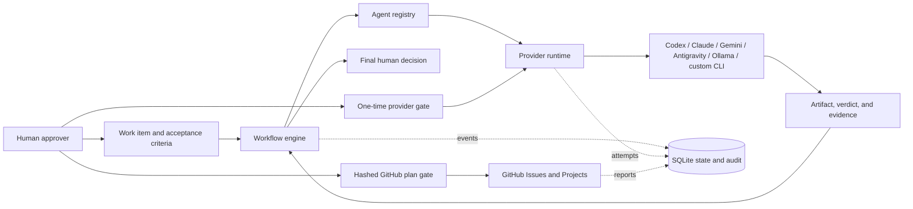

# Agent Factory

**Coordinate specialist AI agents as one traceable, human-controlled delivery system.**

Agent Factory turns a work item into a sequential, reviewable chain of specialist artifacts across interchangeable AI providers. Agents can plan, propose implementations, validate, and issue evidence-backed verdicts. Every real provider execution and external mutation remains bounded, recorded, and subject to explicit human approval.

The factory is project-neutral. Bring your own repository, requirements, roles, workflows, acceptance criteria, and provider accounts.

> **Alpha:** the deterministic simulation, guarded single-provider execution, local orchestration state, and dry-run GitHub planning are usable today. Full unattended multi-stage live execution, native HTTP providers, and a hosted control plane are not yet complete.

## Why Agent Factory

- **Provider independence.** Replace a provider without rewriting the role or workflow.
- **Evidence before progress.** Each stage returns a typed verdict and evidence for every acceptance criterion.
- **Two separate approval layers.** Permission to call a provider never means permission to accept the delivered work.
- **Safe-by-default execution.** Fixed executables and arguments, no shell, role allowlists, timeouts, output caps, and process-tree cleanup.
- **Reviewable GitHub changes.** Mutations start as immutable, hashed plans and are dry-run by default.
- **Local-first state.** Work items, runs, artifacts, attempts, gates, and audit events live in a versioned SQLite database.
- **Offline demonstration.** The deterministic provider exercises the entire orchestration path without accounts, network access, or token spend.

## What is implemented

| Capability | Status | Notes |
|---|---|---|
| Application services | Ready | Typed operator queries and guarded commands are shared by the CLI and future local web host. |
| Agent registry | Ready | List, enable, disable, and replace provider/model assignments. |
| Independent review routing | Ready | Rotating proxy-reviewer pools exclude producer models and persist every assignment. |
| Workflow engine | Ready | Dependency validation, cycle detection, ordered stages, typed verdicts, and evidence checks. |
| Provider runtime | Guarded advisory | Deterministic, Codex, Claude, Gemini, Antigravity, and Ollama adapters; every live call requires a one-use gate. |
| OpenClaw adapter | Health-only | Execution stays disabled until a dedicated no-tools profile is proven. |
| Human approval gates | Ready | Provider gates are scoped to one provider, agent, and work item; final acceptance is separate. |
| SQLite state and audit | Ready | Versioned migrations, WAL mode, integrity checks, backup support, and interrupted-attempt reconciliation. |
| GitHub Issues and Projects | Alpha | Reads and dry-run plans are ready; live allowlisted changes require a matching approval gate. |
| Docker | Simulation-only | The image runs as a non-root user with persistent `/data`; external provider CLIs are not bundled. |
| HTTP model APIs | Planned | DeepSeek, OpenRouter, Mistral, Groq, and similar services require a future HTTP adapter. |
| Local Control Center | In progress | Shared services, loopback API, live dashboard, and guarded work-item/workflow controls are ready; agent routing, review, audit, and qualification remain. |

## How it works



## Local demo

The demo is deterministic. It does not invoke an external model or mutate GitHub.

The Local Control Center dashboard and read API can be started with `python -m pip install -e ".[web]"` followed by `agent-factory --workspace . web`. It binds to `127.0.0.1:8765` by default; see [Local Control Center](docs/local-control-center.md).

### Windows PowerShell

```powershell
winget install --id Git.Git --exact --source winget
winget install --id Python.Python.3.12 --exact --source winget
# Close and reopen PowerShell after first-time installs, then continue:
git --version
py -3.12 --version
git clone <repository-url> AgentFactory
Set-Location AgentFactory
py -3.12 -m venv .venv
& .\.venv\Scripts\python.exe -m pip install --upgrade pip
& .\.venv\Scripts\python.exe -m pip install -e .
& .\.venv\Scripts\agent-factory.exe env check
& .\.venv\Scripts\agent-factory.exe demo
```

Replace `<repository-url>` with the clone URL supplied by the publisher. If Git and Python 3.11+ are already installed, skip the two `winget install` commands. For a private repository, authenticate with its hosting service first; never embed an access token in the clone URL.

### macOS or Linux

```bash
git clone <repository-url> AgentFactory
cd AgentFactory
python3.11 -m venv .venv
.venv/bin/python -m pip install --upgrade pip
.venv/bin/python -m pip install -e .
.venv/bin/agent-factory env check
.venv/bin/agent-factory demo
```

Replace `<repository-url>` with the clone URL supplied by the publisher. Activating the virtual environment is optional; these examples invoke its entry point directly.

Later examples shorten the command to `agent-factory`. Without activation, substitute `& .\.venv\Scripts\agent-factory.exe` on Windows PowerShell or `.venv/bin/agent-factory` on macOS and Linux.

## Docker demo

Docker intentionally runs simulation mode by default.

```bash
docker compose build
docker compose run --rm agent-factory demo
```

State persists in the named `agent-factory-data` volume. The container is read-only apart from `/data` and temporary storage. To use real provider CLIs, run Agent Factory on the host or build a private image that installs and authenticates each required CLI.

## First project and work item

```bash
agent-factory project init --name "Example Product" --description "A small, measurable delivery"
agent-factory project list
agent-factory work-item create --project-id 1 --title "First capability" --description "Deliver one independently reviewable capability" --kind task --acceptance "Criterion one" --acceptance "Criterion two"
agent-factory work-item list --project-id 1
```

You can also validate and import a structured backlog:

```bash
agent-factory backlog validate --path examples/backlog.json
agent-factory backlog import --path examples/backlog.json --project-id 1
agent-factory backlog sync --path examples/backlog.json --repo OWNER/REPOSITORY
```

Use `agent-factory <command> --help` before automation; alpha command flags may evolve before version 1.0.

## Run one real provider safely

First install and authenticate the provider CLI, then confirm discovery:

```bash
agent-factory providers status
agent-factory agents list
```

Request a gate for exactly one provider, agent, and work item:

```bash
agent-factory providers request ollama --agent coding-worker-ollama --task-id 1
agent-factory providers gates
agent-factory providers approve 1 --note "One bounded local artifact"
agent-factory providers invoke 1
```

An approved gate is consumed by one logical attempt, including failed or interrupted attempts. A retry requires a new gate. Provider output remains advisory.

Final workflow acceptance is separate:

```bash
agent-factory approvals list
agent-factory approvals approve 1 --note "Evidence reviewed"
```

## Provider overview

| Provider ID | Execution mode | Intended use |
|---|---|---|
| `deterministic` | Offline simulation | Installation checks, workflow development, CI, and demonstrations. |
| `codex` | Read-only sandbox | Implementation proposals, technical analysis, and validation. |
| `claude` | Plan mode | Planning, rotating proxy review, decomposition, and independent judgment. |
| `gemini` | Plan mode | Alternative planning, review, and implementation proposals. |
| `antigravity` | Plan mode plus OS sandbox | Non-interactive implementation proposals, planning, and independent review. |
| `ollama` | Local, no tools | Private local artifacts and low-cost review. |
| `openclaw` | Disabled | Health probe only until a no-tools execution profile is available. |

Antigravity CLI 1.1.9 requires its non-interactive prompt as a process argument. Agent Factory excludes that prompt from retained command metadata, but local process inspection may still see it while the provider runs. Use Antigravity only for non-secret work-item content.

Provider authentication belongs to each CLI's own profile or operating-system keyring. Never put credentials in work-item or provider prompts. Agent Factory filters sensitive environment-variable names, but comprehensive value-aware output redaction is not implemented; inspect artifacts before sharing them. See [Provider setup](docs/providers.md).

## CLI map

```text
agent-factory env check
agent-factory project init | list
agent-factory work-item create | list
agent-factory agents list | enable | disable | replace
agent-factory backlog validate | import | sync | gates | approve | reject
agent-factory providers status | request | gates | approve | reject | invoke
agent-factory task claim | run | review
agent-factory reviews list [--run-id RUN_ID]
agent-factory workflow run
agent-factory approvals list | approve | reject
agent-factory audit list
agent-factory state check | backup | stale
agent-factory demo
```

## Safety model

Agent Factory treats every provider response and imported backlog as untrusted input.

- Real providers cannot run without a matching one-time human gate.
- Provider commands use fixed configuration, `shell=false`, a repository-scoped working directory, and bounded execution.
- An agent role must appear in the provider's allowlist.
- Simulation artifacts are explicitly labeled and never masquerade as live evidence.
- GitHub operations are dry-run by default and restricted to an allowlist.
- Automatic merging, closing, deletion, and final approval are not supported.
- Reviewer routing excludes all producer model identities declared by `review_of`; a reviewer verdict cannot grant final acceptance.
- Every important transition is recorded in the local audit stream.
- Every provider approval stores immutable request and definition digests; task, agent, provider, or policy drift invalidates the gate before a subprocess starts.

This is defense in depth, not a complete security boundary. Read the [security policy](SECURITY.md) and [architecture](docs/architecture.md) before enabling real providers.

## Configuration

Shipped defaults are package resources. Override them by pointing `AGENT_FACTORY_CONFIG_DIR` at a directory containing reviewed configuration files. Set `AGENT_FACTORY_WORKSPACE` to the repository providers may inspect and `AGENT_FACTORY_DB` to the SQLite path.

The configuration format is JSON-compatible YAML: valid JSON stored with a `.yaml` or `.json` suffix. This keeps the core runtime dependency-free.

See:

- [Getting started](docs/getting-started.md)
- [Architecture](docs/architecture.md)
- [Development roadmap](docs/development-roadmap.md)
- [Providers](docs/providers.md)
- [Workflows](docs/workflows.md)
- [GitHub integration](docs/github-integration.md)
- [Operations](docs/operations.md)

## Extending the factory

- Add a CLI provider through reviewed configuration when its command can be fixed and non-interactive.
- Add an agent by assigning an ID, role, provider, instructions, and permissions.
- Add a workflow by composing typed, dependency-aware stages.
- Add a new provider transport by implementing the provider interface and its health and execution contracts.
- Add a storage backend behind the repository boundary; PostgreSQL is not implemented yet.
- Extend GitHub mutations only by adding a narrowly defined action plus negative and idempotency tests.

## Development

```bash
python -m pip install -e ".[web,dev]"
python -m unittest discover -s tests -v
python -m compileall -q src tests
python -m pip install build
python -m build
```

The repository CI runs Python 3.11 and 3.12 tests on Windows, Ubuntu, and macOS, builds a wheel, tests a clean installation outside the checkout, and builds the Docker image. CI validates deterministic execution and adapter/configuration portability; it does not authenticate providers or run live provider canaries.

## Alpha limitations

- Multi-stage live workflows still require explicit approval handling for every real provider call.
- Provider output limits are enforced on the retained artifact; streaming byte limits are planned.
- Sensitive environment names are filtered, but comprehensive value-aware redaction is planned.
- Windows cleanup uses a contained process group and targeted tree termination, not a Job Object.
- SQLite is the only state backend.
- External provider CLIs and their subscriptions are installed, authenticated, billed, and updated independently.
- The Docker image is intended for simulation and control-plane evaluation, not host CLI passthrough.

## Contributing and licensing

Read [CONTRIBUTING.md](CONTRIBUTING.md) before opening a pull request. Security reports belong in private GitHub Security Advisories as described in [SECURITY.md](SECURITY.md).

No license has been granted yet. Until the repository owner adds an explicit license, copyright law reserves all rights and external use, copying, modification, and redistribution require permission.
