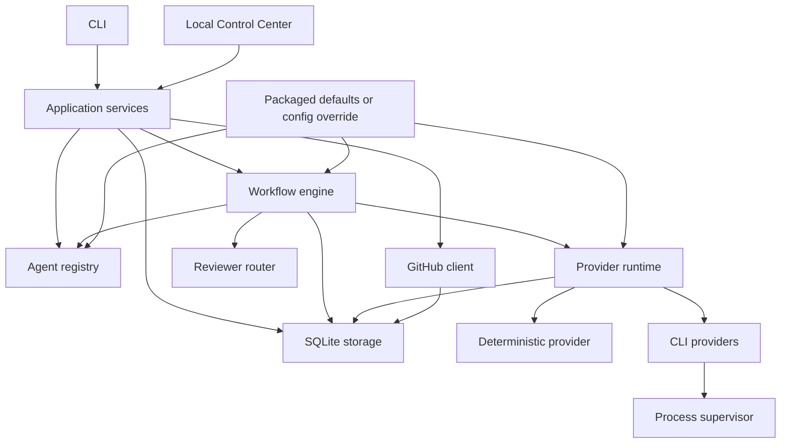
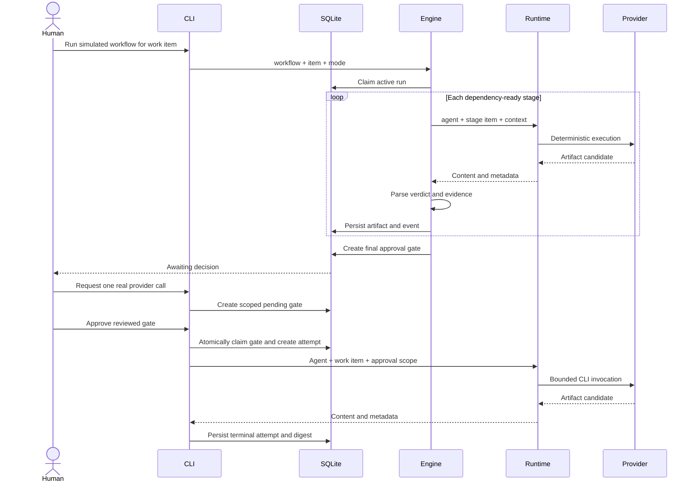

# Architecture

Agent Factory is a local-first orchestration control plane. It coordinates work; it does not grant an AI provider authority to approve its own output.

## Design goals

1. Keep project policy separate from orchestration code.
2. Make provider selection replaceable at configuration boundaries.
3. Produce reviewable artifacts and evidence at every stage.
4. Require human decisions for real execution and final acceptance.
5. Fail closed when workflow contracts, approvals, or provider definitions do not match.
6. Keep the deterministic path offline and suitable for CI.
7. Preserve enough state to understand what happened after failure or interruption.

## Component map



### CLI

`agent_factory.cli` maps terminal arguments and presentation onto shared application operations. It does not own business-state transitions.

### Application services

`agent_factory.application.AgentFactoryService` is the operator-facing boundary shared by the CLI and Local Control Center. Its immutable dataclass query results cover projects, work items, runs, artifacts, agents, providers, reviewer assignments, every approval kind, audit events, and effective runtime settings. JSON stored in SQLite is decoded before it crosses this boundary.

Commands for workflow execution, reviews, human decisions, agent configuration, provider execution, backlog import, GitHub planning/apply, backup, and recovery call the existing registry, workflow, runtime, storage, approval, and audit implementations directly. A web handler must call this service; it must not launch a CLI subprocess or reproduce an orchestration transition.

The service is deliberately transport-neutral and has no FastAPI dependency. Contract tests run equivalent CLI and direct-service operations against separate databases and compare their final states and ordered audit event types.

### Agent registry

The registry loads agent definitions from reviewed configuration. Each agent has:

- a stable ID and display name;
- a semantic role;
- an enabled state;
- one provider assignment;
- role instructions;
- declared permissions.

Enable, disable, and provider replacement operations update the configured registry rather than changing workflow code.

### Workflow engine

The engine loads a workflow, validates its graph, then executes stages in deterministic topological order. A stage declares:

- a unique ID and name;
- an agent;
- an output artifact name;
- stage dependencies;
- acceptance criteria;
- allowed verdicts.

The default `delivery` workflow has a policy pre-check, implementation proposal, acceptance validation, and policy post-check. Guardrail stage IDs and the guardian agent are declared in configuration rather than hard-coded to a business domain.

Review stages declare a reviewer pool and one or more ancestor artifacts in
`review_of`. The reviewer router excludes producer agents and model identities,
rotates among the least-used eligible reviewers, and persists both the selection
rationale and producer/reviewer identities. This prevents a model from repeatedly
judging its own output while keeping provider assignments replaceable.

### Provider runtime

The runtime selects the configured provider for an agent. In simulation mode it may fall back to the deterministic provider. Live mode prohibits deterministic fallback.

The provider interface separates health inspection from execution. The current executable adapters are CLI-based; a future HTTP adapter can implement the same interface without changing agent definitions.

### Process supervisor

CLI providers start without a shell in a new process group. The supervisor applies:

- fixed executable resolution;
- fixed argument vectors;
- repository-scoped working directory;
- UTF-8 decoding with replacement;
- bounded execution time;
- retained-output limits;
- targeted process-tree termination on timeout.

On Windows, stable native executable candidates are tried before unreliable execution aliases. On Unix-like systems, the runtime uses a new process session and targets that process group on termination.

### SQLite storage

SQLite is the orchestration state store, not the source repository. It contains:

- projects and work items;
- workflow runs and active-run claims;
- artifacts and review notes;
- durable reviewer assignments and rotation history;
- final approval gates;
- provider execution gates and attempts;
- GitHub plans, gates, idempotency keys, and reports;
- audit events;
- schema migration history.

Foreign keys, explicit state transitions, transactions, and unique claims protect local invariants. WAL mode allows safe concurrent readers and bounded writer waiting.

## Core data flow



## Approval model

Agent Factory deliberately separates three concepts:

1. **Provider execution approval** authorizes one provider, agent, and work item tuple.
2. **GitHub plan approval** authorizes one immutable repository plan identified by its SHA-256 digest.
3. **Final workflow approval** accepts or rejects the accumulated delivery evidence.

No successful provider response creates any of these decisions automatically.
Proxy reviewers perform the routine evidence review, but their verdict remains an
artifact: final workflow acceptance, merge, and external closure remain separate.

Provider approval consumption is atomic. The database records an execution attempt before a subprocess starts. An interrupted attempt is reconciled to a terminal abandoned state, and retry requires a new gate.

Writable worker processes additionally cross the [local sandbox boundary](local-sandbox.md). A live fenced assignment, immutable path/limit policy, and qualified OS backend are prerequisites. Unsupported hosts fail before launch; a process group or prompt instruction is never treated as filesystem or network isolation. Teardown preserves bounded execution evidence and the candidate change manifest outside the worker's writable roots.

The [Worker Runtime contract](worker-runtime.md) owns durable start, resume, heartbeat, cancel, event collection, and finalization semantics above provider/transport drivers. Direct CLI and Hermes ACP use the same immutable session-event model. A mutable event closes the fallback boundary permanently; runtime terminal success remains subordinate to Control Plane evidence, review, and acceptance.

The [managed worktree service](managed-worktrees.md) is the only component allowed to create task Git worktrees. It binds deterministic branch/path identity to an approved base SHA and live fenced assignment before mutation, detects dirty/missing/orphaned state without destructive adoption, and permits cleanup only after terminal state plus the persisted retention deadline.

The [Execution Context Package builder](execution-context-packages.md) snapshots task scope, acceptance criteria, dependencies, approved base, effective policy, requirements, and prior decisions before dispatch. Its canonical digest is bound to the live fenced assignment and runtime session. Source selection and compaction are deterministic and fully manifested; workers cannot widen or replace the package after launch.

The [Hermes ACP runtime](hermes-acp-runtime.md) is the concrete stdio process boundary. It binds the AF-044 session to the active workflow stage, attempt, AF-048 worktree, and AF-055 package; admits only the exactly qualified Hermes/tool version; maps JSON-RPC events and permissions; reloads the stable Hermes identity after Control Plane restart; and owns complete child-tree cancellation.

The [live-stage approval service](live-stage-approvals.md) connects a durable `waiting_approval` checkpoint to mutable runtime launch. It reconstructs the exact task/run/stage/worker/runtime/worktree/permission scope, consumes one approved gate for one logical attempt before process creation, and advances the next dependency-ready stage after completion. A worker runtime cannot approve, widen, replay, or redirect this authority.

## Workflow contracts

Real providers must return structured JSON:

```json
{
  "verdict": "PASS",
  "criteria_evidence": {
    "Every criterion has evidence": "Test report artifact 12 covers all listed criteria."
  },
  "summary": "Validation passed with one documented residual risk."
}
```

The stage decides which verdicts are legal. Blocking verdicts stop the run and prevent creation of a final approval gate. Missing evidence, malformed JSON, cycles, missing dependencies, and ambiguous order also fail closed.

## Configuration resolution

Defaults ship inside the Python package:

```text
agent_factory/defaults/
  agents.json
  policy.json
  providers.json
  workflows.json
```

`AGENT_FACTORY_CONFIG_DIR` replaces the default directory with an operator-reviewed configuration set. `AGENT_FACTORY_WORKSPACE` defines the provider working directory. `AGENT_FACTORY_DB` overrides the state database path.

Configuration is JSON-compatible YAML. Runtime input cannot add executable names, switches, model IDs, profiles, paths, URLs, or environment variables to an approved provider definition.

## GitHub boundary

GitHub synchronization follows plan, review, approve, apply:

1. normalize requested operations;
2. validate the entire action allowlist;
3. persist an immutable plan and SHA-256 digest;
4. show a dry-run preview;
5. request a matching human gate;
6. verify authenticated repository access;
7. execute idempotently;
8. persist a success, partial, or failure report.

Unsupported destructive operations are rejected before any network mutation.

## Trust boundaries

Trusted configuration is code. Changes to agents, provider commands, policy, and workflows require review.

Untrusted inputs include:

- provider output;
- repository files and documentation;
- imported backlog files;
- issue bodies and comments;
- subprocess stdout and stderr;
- environment values;
- stale local state from interrupted runs.

Artifacts are evidence, not authority.

## Current limitations

- SQLite is the only implemented backend.
- CLI providers are the only live transport.
- Full multi-stage live orchestration still needs a distinct approved attempt for each real call.
- Retained output is capped after process communication; streaming byte enforcement is planned.
- Environment filtering is based on sensitive key-name markers; value-aware redaction is planned.
- The event stream is append-only through application code but not cryptographically tamper-evident.
- Windows cleanup does not yet use a Job Object.
- The Docker image intentionally supports deterministic simulation rather than host provider passthrough.
