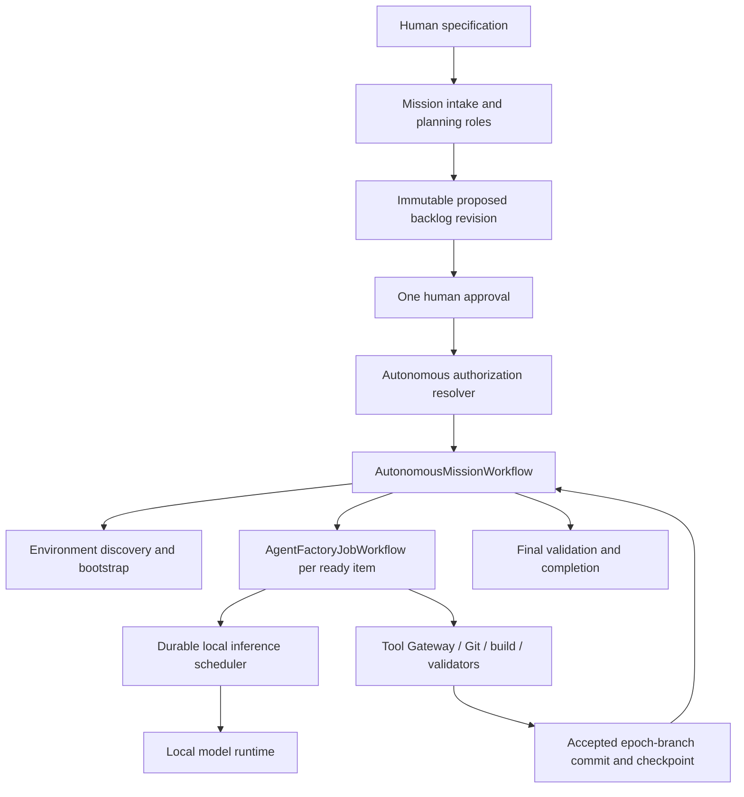

# Autonomous Mission Mode: specification and repository review

> **Historical architecture review.** The baseline below is commit `9377642`, not the current implementation. Subsequent work includes first-class schema-v2 features and persisted rich contracts; retain the requirements and safety interpretations, but do not read the original gap list as today's status. The active delivery order is the [Game Creator 12+ backlog](game-creator-backlog.uk.md); see the [5 September product audit](product-audit-2026-09-05.uk.md) for current evidence.

Status: **approved for implementation planning, with the interpretations in this document treated as required safety and durability constraints**.

This review compares the user-provided *AgentFactory Autonomous Mission Mode — Implementation Specification* (sections 1–43) with the repository at commit `9377642`. The executable implementation plan is the validator-compatible [Autonomous Mission backlog](../examples/autonomous-mission-backlog.json). This document and that manifest describe required work; neither is evidence that the feature is already implemented. The legacy manifest retains schema-v1-compatible items plus `agentfactory.rich-backlog/v1` extension fields. At that baseline, persistence of rich fields was planned in AF-AMM-002; the current implementation supports persisted rich contracts and schema-v2 features.

## Executive assessment

Autonomous Mission Mode fits the existing AgentFactory architecture, but it is a new orchestration and authorization layer rather than a configuration switch on the current job workflow. The repository already contains most of the lower-level building blocks: mission intake, Factory Blueprints, immutable approvals, durable stages, leases, managed worktrees, context packages, typed memory, engineering loops, validators, reviewers, evidence, audit, recovery inspection, application services, REST/CLI/UI surfaces, and a Temporal worker.

The material gaps are:

1. there is no mutable long-running Autonomous Mission aggregate, active backlog revision, execution epoch, or reconstructible mission checkpoint;
2. `AgentFactoryJobWorkflow` orchestrates one existing run and has no project-level parent workflow, child-work-item loop, restart epoch, or continue-as-new policy;
3. every configured CLI provider, including Ollama, requires an exact one-use provider approval, while a Blueprint execution authorization is not a provider-call authorization;
4. the Ollama adapter is a prompt/response CLI adapter with a configured model in its argument vector; it is not a writable, tool-using local engineering runtime and there is no durable one-GPU scheduler;
5. the uploaded-specification analyzer is conservative deterministic heading extraction, not the requested multi-role architecture and backlog planning pipeline;
6. current checkpoints represent durable workflow stage transitions or one initial bootstrap snapshot, not Git-backed mission restoration points;
7. environment inspection reports command presence, but there is no versioned required-vs-current plan, idempotent bootstrap executor, service manifest, or autonomous service recovery;
8. the standard engineering loop enforces token and cost caps and the current reviewer router excludes the producer model, so both need explicit opt-in Autonomous Local semantics;
9. current API, CLI, and Control Center expose standard work items/runs and Temporal pause/resume/cancel, not the mission/revision/epoch/checkpoint model in the specification.

The recommended delivery is incremental. First prove the authorization boundary and a single local-model/single-task vertical slice. Then add environment bootstrap, multi-item execution, restart/revision semantics, operator surfaces, and long-run qualification. Do not build a parallel autonomous framework.

## Current repository baseline

| Area | Existing implementation to reuse | Gap for Autonomous Mission Mode |
|---|---|---|
| Mission intake and architecture | `mission_intake.py`, `blueprint.py`, `mission_bootstrap.py`, Workforce Composer, role definitions | Intake currently requires an existing project; bootstrapped missions are immutable `ready` records and have no lifecycle, active revision, epoch, or autonomous configuration. |
| Backlog | `backlog.py`, `backlog_analyzer.py`, import/sync application services | Schema v1 lacks an explicit feature kind, priority, validation method, infrastructure/artifact/DoD fields, revision lineage, item impact state, and active-revision projection. The analyzer does not invoke planning roles. |
| Temporal | `AgentFactoryJobWorkflow`, Activities, client, Worker, pause/resume/cancel, retry policies | No parent mission workflow, child-workflow control, mission Signals, continue-as-new, workflow deployment versioning, or months-long history policy. Namespace retention defaults to seven days. |
| Human authority | One-use provider gates, scoped stage approvals, Blueprint signatures and execution authorizations, Founder and GitHub gates | No authorization resolver for `AUTONOMOUS_LOCAL`. Existing provider, Founder, and release gates cannot simply be disabled globally. |
| Providers and models | Provider-neutral runtime, Ollama configuration, model identities, health checks | No `execution_location` capability, installed-model inventory, dynamic per-role model selection, model load/release lifecycle, global inference lane, or local writable worker runtime. |
| Engineering and review | Durable loop, coding delivery, candidates, validators, independent review, repair | Existing Temporal stage adapter creates advisory artifacts rather than completing the full coding-delivery loop. Token/cost caps block work. Same-model review is intentionally rejected. |
| Git | Fenced task worktrees, deterministic branches, reconciliation, branch-preserving cleanup | Branches are task/lease-scoped rather than mission/epoch-scoped. There is no checkpoint commit restoration, epoch supersession, or local integration branch. |
| Context and memory | Immutable bounded context packages, Context Broker, typed memory and invalidation | Mission-specific retrieval/materialization policies and fresh isolated role invocations must be wired into the parent loop. |
| Environment | Basic command discovery and an immutable bootstrap environment manifest | No hardware/storage/model/service/port inventory, required-vs-current diff, bootstrap operation journal, health convergence, or service restart controller. |
| Recovery | Durable stage resume, mutation reservation, local orphan inspection, integrity checks | Mutation journal covers only provider call/worktree/GitHub categories. It does not reconstruct a whole mission or converge services after a host restart. |
| Operator surfaces | Shared application service, FastAPI, CLI, vanilla local Control Center, persisted audit | No Autonomous Missions resource, revision/checkpoint/activity projections, mission controls, or approval/edit/restart flows. |

## Required architectural interpretations

These interpretations resolve ambiguities in the specification and prevent incompatible implementations.

### 1. Preserve phase separately from runtime disposition

A mission has two durable dimensions:

- `phase`: draft, analysis, backlog generation, approval wait, environment discovery/bootstrap, development, validation, integration, final validation, completed;
- `disposition`: running, paused, stopped, needs attention, needs human action, replanning, recovering, failed.

Pausing or stopping must not erase the phase from which execution resumes. `COMPLETED` is terminal. `PAUSED` and `STOPPED` are resumable dispositions. A separate explicit revocation/retirement action, not `stop`, ends autonomous authorization.

### 2. Temporal and AgentFactory have distinct authority

Temporal owns orchestration history, timers, signal ordering, safe-boundary scheduling, child-workflow coordination, and the continue-as-new chain. SQLite owns mission domain records, immutable backlog revisions, approvals, authorization, epochs, checkpoints, evidence, activity, manifests, and audit. Git owns project content. Services and containers are derived runtime state that must be reconciled against the environment/service manifest.

Workflow history must contain identifiers and bounded summaries, not source trees, model output, logs, or full manifests.

### 3. Temporal is a prerequisite, not mission bootstrap output

`AutonomousMissionWorkflow` cannot bootstrap the Temporal server on which it is already running. CLI/Control Center startup and the optional Windows long-run profile must establish Temporal, its PostgreSQL store, the AgentFactory worker, and the local backend before a mission starts. Mission environment bootstrap may prepare project-specific databases and services, including a separate Temporal deployment if the target project itself needs one.

### 4. Backlog approval grants a bounded capability, not blanket machine authority

Approval binds the exact mission, backlog revision and digest, local role/model assignments, repository root, epoch branch, allowed local tool profile, environment bootstrap policy, and policy version. It authorizes:

- local inference through providers explicitly marked `LOCAL`;
- allowlisted project-scoped tools and bootstrap operations;
- deterministic builds, tests, service control, and Git commits on AgentFactory-owned epoch branches.

It does not implicitly authorize remote LLM APIs, arbitrary network egress, protected-branch merge, GitHub mutation, publication, secret access, unrestricted shell execution, or machine-global modification. Existing gates remain authoritative for those actions unless a future separately reviewed policy adds them.

Before backlog approval, the explicit human `analyze` or `regenerate backlog` command may create a bounded read-only local planning authorization for that one proposal run. It permits only the configured planning roles and artifact-producing read tools; it cannot authorize environment bootstrap, repository mutation, development, or integration. Remote planning providers continue through the standard gate model.

`STOPPED` retains this authorization; revocation, an unapproved material agent revision, or a changed local execution policy invalidates it.

### 5. “Local models only” describes inference location

Package and model downloads are tool/network operations, not remote inference. They may occur only when the approved tool profile permits the destination and egress class. Provider capability must be explicit (`LOCAL` or `REMOTE`); provider name matching is not sufficient.

### 6. Local integration ends at the mission epoch branch

The autonomous loop may commit accepted work and integrate item branches into `autonomous/<mission>/epoch-<n>`. It must not reset or rewrite the main project branch. Publishing, merging to a protected branch, opening a remote pull request, or closing external work keeps the current standard approval behavior.

### 7. Checkpoints are reconstructible, content-addressed records

A restartable code checkpoint must reference a committed Git SHA. Dirty or partially applied tool state is evidence, not a valid restart point. Environment-only checkpoints bind the authoritative base SHA plus versioned environment/service manifests. A checkpoint record is immutable and later records are never deleted; an epoch marks later history as superseded only in projections.

Host-sensitive environment details belong in the AgentFactory artifact/state store by default and are not automatically committed into the target repository.

### 8. Pause and stop require a mission-wide scheduling fence

Checking only between Temporal Activities is insufficient once a local worker can call several tools. Before every new LLM inference, command, installation, service action, and next work item, the Activity/runtime must verify the current mission control fence and authorization epoch.

Pause lets the current atomic operation finish, then holds all new operations. Stop converges to a safe boundary, releases inference and execution leases, and waits durably in `STOPPED`. Resume/continue does not repeat committed accepted work. Forced process cleanup after a mutable action relies on the operation journal and reconciliation before retry.

### 9. Continue-as-new and deployment versioning are both required

Continue-as-new is performed at checkpoints and other safe boundaries using a compact carry-over document containing mission identity, revision, epoch, checkpoint, current work item, and control disposition. A history threshold and Temporal’s continue-as-new recommendation trigger rollover. Worker code changes must retain replay compatibility through Temporal patching/build-version policy; continue-as-new alone does not make incompatible deployments safe.

### 10. The GPU lane is durable and global

`max_concurrent_local_llm=1` applies across all Autonomous Missions sharing the configured local inference pool. The scheduler needs a fair queue, durable lease, heartbeat, fencing token, cancellation/release, orphan reconciliation, and model lifecycle evidence. An in-process semaphore is not restart-safe. CPU validators and builds do not consume the LLM lane unless policy explicitly says otherwise.

### 11. A local model needs a real worker/tool runtime

The present Ollama CLI adapter can generate text but cannot implement a repository autonomously. Add a provider-neutral local worker runtime that executes structured role turns, validates output schemas, and invokes only Tool Gateway operations authorized for that role and mission. Ollama is the first provider-specific transport; model selection and keep-alive/load/release behavior remain capabilities rather than mission workflow logic.

### 12. Same-model review is isolated, not falsely model-independent

`MODEL_INDEPENDENT` remains preferred. `LOGICALLY_INDEPENDENT` uses a distinct reviewer role/agent invocation with a fresh context package and no session/transcript reuse. Evidence records the producer and reviewer agent IDs, model identity, context digests, independence class, and reason for fallback. This exception is scoped to Autonomous Local review and does not weaken standard review routing.

### 13. Local cost/token usage is observational, but safety remains bounded

Autonomous Local mode does not block on monetary or cumulative token authorization budgets. Technical context/output limits, Activity timeouts, disk limits, command timeouts, repair-strategy bounds, tool-risk policy, and no-progress detection remain enforced. Tokens, duration, model/GPU use, commands, attempts, and tool calls remain persisted telemetry.

### 14. Dynamic changes have three origins

- `TECHNICAL_SUBTASK`: agent-created, traceable to an approved item, no product-scope change, automatically executable;
- `HUMAN_REVISION`: immutable and authorized when the authenticated mission owner explicitly applies it;
- `AGENT_MATERIAL_REVISION`: proposed only and returns the mission to backlog approval wait.

The impact analyzer classifies every stable item as `VALID`, `STALE`, `PARTIALLY_AFFECTED`, `REMOVED`, or `NEW`. It must not infer material scope solely from unstructured model prose; structured change reasons and deterministic policy checks are required.

### 15. Commands and Signals are idempotent domain actions

Every API/CLI/UI command carries an actor, idempotency key, expected active revision/epoch or ETag, and typed payload. Temporal Signals carry a durable command identity; an Activity records the domain transition and audit event exactly once. `retry_current_task`, checkpoint restart, and revision application need explicit payload contracts rather than string-only signals.

## Proposed component shape

The suggested new modules are integration services, not a second framework:

- `autonomous_mission.py`: mission aggregate, lifecycle/disposition policy, read model;
- `backlog_revisions.py`: rich typed backlog, immutable revisions, impact analysis;
- `autonomous_authorization.py`: mission authorization resolver and revocation;
- `mission_checkpoints.py`: checkpoint/epoch state and integrity;
- `local_model_scheduler.py`: durable local inference queue and lease;
- `environment_bootstrap.py`: discovery, manifests, plan validation/execution, health convergence.

The existing Temporal package gains the parent Workflow, typed payloads, Activities, client operations, Worker registration, policies, and tests. Existing coding-delivery, worktree, validator, reviewer, Tool Gateway, context, memory, evidence, audit, recovery, application, web, CLI, and UI code remains the implementation substrate.



## Delivery slices and critical path

| Slice | Demonstrable outcome | Backlog tasks |
|---|---|---|
| S0 — Domain boundary | Migrations represent mission state, rich revisions, authorization, epochs, and checkpoints without changing standard behavior. | AF-AMM-001–AF-AMM-006 |
| S1 — Plan and approve | A natural-language specification produces a reviewed architecture/backlog and stops at the exact approval boundary. | AF-AMM-007–AF-AMM-011 |
| S2 — Durable vertical slice | The parent Temporal workflow runs one approved item with one fake/local model, pauses/resumes safely, commits to an epoch branch, and checkpoints. | AF-AMM-012–AF-AMM-021, AF-AMM-023–AF-AMM-029, AF-AMM-035–AF-AMM-040 |
| S3 — Bootstrap and recovery | The mission discovers and prepares a project environment, survives process/service restart, and converges health without duplicate operations. | AF-AMM-030–AF-AMM-034 |
| S4 — Revision and restart | A human applies backlog changes from a selected checkpoint; a new epoch starts while old history remains inspectable. | AF-AMM-016, AF-AMM-021, AF-AMM-022 |
| S5 — Operator product | REST, CLI, and Control Center expose the same mission commands and persisted projections. | AF-AMM-041–AF-AMM-045 |
| S6 — Release qualification | Compatibility, security, end-to-end, fault/restart, and soak evidence satisfy the specification’s Definition of Done. | AF-AMM-046–AF-AMM-048 |

Principal dependency gates:

```text
Domain:       AF-AMM-001 -> AF-AMM-002 -> AF-AMM-005 -> AF-AMM-006
Planning:     AF-AMM-001 -> AF-AMM-007; AF-AMM-006 + 007 -> 008 -> 009 -> 010
Approval:     AF-AMM-002 + 005 + 010 -> AF-AMM-011
Temporal:     AF-AMM-001 + 003 + 011 -> 012 -> 014 -> 015 -> 016 -> 017 -> 018
Git:          AF-AMM-003 -> AF-AMM-019 -> AF-AMM-020 -> AF-AMM-021 -> AF-AMM-022
Local model:  AF-AMM-006 + 008 -> 023 -> 024 -> 025 -> 026 -> 027 -> 028
Engineering:  AF-AMM-002 + 014 -> 035; AF-AMM-020 + 026 + 027 + 035 -> 036
Recovery:     AF-AMM-028 + 029 + 036 -> 037 -> 038; AF-AMM-021 + 027 + 036 -> 039 -> 040
Product:      AF-AMM-011 + 018 + 022 + 029 + 033 + 040 -> 041 -> 042/043 -> 044 -> 045
Release:      AF-AMM-046 + AF-AMM-047 + operator surfaces -> AF-AMM-048
```

## Principal risks

| Risk | Consequence | Required mitigation |
|---|---|---|
| Writable local model bypasses authority | Arbitrary machine or repository mutation | Tool Gateway-only mutation, exact mission authorization, role allowlists, fenced worktree, evidence for every operation. |
| Temporal/SQLite/Git state diverges | Duplicate or lost accepted work | Explicit source-of-truth boundaries, idempotent command IDs, operation journal, checkpoint integrity verification, recovery reconciliation. |
| Pause/stop races a tool call | Work continues after operator intent | Mission-wide control fence before every inference/tool action and fencing-token rejection after release. |
| One-GPU scheduler leaks a lease | Missions deadlock or models overlap in VRAM | Durable fair queue, heartbeat, lease expiry, orphan reconciliation, bounded unload verification. |
| Workflow code changes break replay | Months-long mission becomes unrecoverable | Worker build/version policy, replay tests, patch markers, safe continue-as-new boundaries. |
| Checkpoint contains dirty/uncommitted state | Restart is not reproducible | Only committed Git SHAs are code checkpoints; retain incomplete state as evidence, never as authoritative restart state. |
| Mission approval silently weakens standard mode | Remote calls or protected mutations bypass gates | Explicit authorization mode and provider location, negative compatibility tests, no global flag. |
| Bootstrap plan is too permissive | Global installs, UAC, port/service damage | Project-local/user-level/container preference, typed allowlisted operations, actual-state verification, `NEEDS_HUMAN_ACTION` for non-interactive blockers. |
| Same-model review is presented as independent | Misleading acceptance evidence | Mandatory independence class and distinct context/session evidence. |
| Long-run evidence grows without bound | SQLite/disk exhaustion | Bounded logs/context, indexed projections, content-addressed artifacts, retention/export policy, resource-growth soak gate. |

## Release gates

Implementation is not complete when only the parent Workflow exists. The release gate requires all of the following:

1. standard deterministic demo, provider gates, Founder approvals, budgets, remote-provider protections, existing CLI, and `AgentFactoryJobWorkflow` regressions pass unchanged;
2. no local or remote provider call starts before an exact backlog approval;
3. a remote provider cannot consume Autonomous Local authorization;
4. one installed local model can plan, implement through controlled tools, validate, review in a fresh logical context, commit, and checkpoint;
5. multiple configured local models serialize through one durable GPU lane;
6. pause, stop/continue, retry, checkpoint restart, and backlog-change restart pass race and replay tests;
7. AgentFactory/Worker/Temporal/PostgreSQL/Docker/Ollama/project-service restarts recover without duplicating accepted work;
8. continue-as-new and worker-upgrade replay tests cover a multi-run logical mission;
9. UI and CLI execute the same application services and expose persisted rather than ephemeral activity;
10. the full user-provided end-to-end scenario reaches `COMPLETED` with repository, active backlog, validation, architecture, checkpoints, manifests, and audit evidence.
