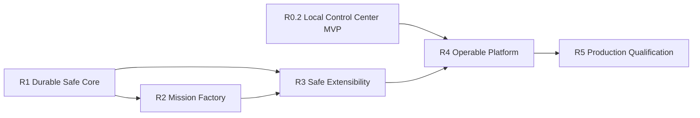

# Development roadmap

This roadmap converts the remaining requirements in *Agent Factory Technical Specification v1.0* (2 August 2026) into an ordered delivery backlog. It is deliberately based on the current repository rather than treating the specification as a greenfield design.

The importable source of the issue list is [`examples/development-backlog.json`](../examples/development-backlog.json). Stable IDs in that file are permanent. Titles, descriptions, priorities, dependencies, and implementation choices may evolve without changing those IDs. Completion claims and evidence are tracked separately in the [2026-08-11 implementation audit](implementation-audit-2026-08-11.md); the manifest describes required outcomes and must not be treated as proof that they exist.

## Current baseline

| Capability | Assessment | Roadmap treatment |
|---|---|---|
| Configured agents, role contracts, and provider adapters | Implemented foundation | AF-005, AF-010, and AF-011 supply qualification/lifecycle, provider-neutral typed roles, and evaluation-aware routing. |
| One-use provider and GitHub approvals | Implemented alpha | Generalize into a deterministic policy plane without weakening existing gates. |
| Static workflow DAG and typed stage evidence | Implemented alpha | Migrate to a versioned durable workflow and criterion-level evidence ledger. |
| SQLite migrations, audit events, backup, and interrupted-attempt reconciliation | Implemented alpha | Preserve data while adding the full domain model, outbox, checkpoints, and recovery. |
| GitHub plan/review/approve/apply | Implemented alpha | Route it through the future tool gateway as the first protected connector. |
| Local web operator experience | R0.2 implemented | Preserve AF-036–AF-043; evolve the loopback single-operator UI behind the later production service boundary. |
| Mission intake, Blueprint, role pools, and Workforce Composer | Mission foundation implemented | AF-009 intake through AF-016 governed memory are complete; AF-018 Tool Gateway and AF-019 credential brokerage are also complete. |
| Durable domain, audit, evidence, policy, adapters, workflow checkpoints, and fenced scheduling | AF-001–AF-007 implemented | M1 is complete; do not reopen completed foundations without regression evidence. |
| Persistent loops, scheduling leases, immutable context, and typed memory | Implemented | AF-006–AF-008 provide checkpoints and bounded repair; AF-055/AF-015 context and AF-016 typed memory complete the governed state path. |
| Sandbox manager, MCP manager, evaluation service, and red-team harness | Ready | AF-017 through AF-021 provide sandboxing, Tool/MCP Gateway, credential brokerage, independent evaluation, and prompt-injection containment. |
| Hermes runtime, coding worktrees, validators, and repair loop | Qualified single-node slice | AF-008, AF-044–AF-053, and AF-056–AF-057 provide qualified Codex/Claude workers, replay-safe, budgeted, restart-safe delivery, and controlled fallback. |
| REST API, PostgreSQL/object-storage contract, multi-tenancy, and clustered deployment | Implemented boundary | AF-026, AF-029, and AF-031 provide authenticated API contracts, tenant governance, and topology definitions; external service drivers remain deployment choices. |
| Pack SDK, production qualification, soak test, acceptance mission, and handover | Implemented | AF-024/025 and AF-032/033/034/035 provide signed lifecycle, qualification, soak, acceptance, and handover evidence. |

## Delivery rules

- Preserve project neutrality: no product-specific workflow or source document belongs in factory core.
- Repeat the read-only Phase 0 environment/access audit from Appendix K for every target deployment; that environment-specific report is an entry gate, not a portable product feature.
- Keep the deterministic offline path working in every release.
- Migrate existing `0.1.x` state forward; do not replace the current safety gates with an incompatible prototype.
- Every accepted task maps each acceptance criterion to stored evidence produced or verified independently of the implementing worker.
- External mutation stays deny-by-default, idempotent, auditable, and approval-gated at the configured risk tier.
- A release is complete only when its executable tasks meet the task Definition of Done below.
- Review risks R-01 through R-20 at every release gate and after any critical incident, provider, tool class, pack, or production architecture change.

## Hermes and Control Plane critical path

[ADR-0001](adr/0001-control-plane-hermes-boundary.md) is authoritative: Hermes executes bounded sessions, tools, skills, and subagents, while the Control Plane retains backlog, policy, approvals, scheduler, budgets, worktrees, evidence, audit, and terminal acceptance. Hermes runtime success can never self-declare a task complete.

The implementation order is:

```text
DONE  AF-001 -> AF-002/AF-003/AF-004 -> AF-005/AF-006 -> AF-007 -> AF-008 -> AF-009; AF-010 -> AF-011 -> AF-012 -> AF-013 -> AF-014 -> AF-015 -> AF-016; AF-017 -> AF-018 -> AF-019 -> AF-021; AF-020 + AF-044 + AF-045 + AF-046 + AF-047 + AF-048 + AF-049 + AF-050 + AF-051 + AF-052 + AF-053 + AF-054 + AF-055 + AF-056 + AF-057

DONE  AF-026 -> AF-035
NOW   complete
```

Core worktree isolation moves from AF-025 into AF-048 and AF-017 is P0. AgentFactory is the sole worktree authority: managed Hermes sessions receive an AF-048 worktree and do not invoke Hermes worktree creation. Mutable Hermes execution uses ACP stdio and its permission bridge; Hermes one-shot mode is restricted to qualification or read-only work because it bypasses interactive approvals. `AF-049` Codex is the first required writable implementation worker. `AF-050` Claude Code is P1 and supplies a compatible alternative after the first vertical slice is proven. The local independent-verdict subset of AF-020 is P0 because AF-053 cannot satisfy its review requirement without it.

### Milestones

| Milestone | Outcome | Tasks |
|---|---|---|
| M1 Durable orchestration core | Work-item lifecycle, dependency readiness, fenced leases, checkpoints, and live-stage waiting states | AF-001 through AF-007; complete |
| M2 First real coding worker | Sandbox subset, runtime contract, Control-Plane-owned worktree/context, Hermes ACP lifecycle, live approvals, and Codex worker | AF-017, AF-044–AF-046, AF-048, AF-049, AF-055 |
| M3 Verified engineering loop | Candidate diffs, deterministic validators, independent criterion review, and bounded repair | AF-008, AF-020, AF-051–AF-053 |
| M4 Budgets and recovery | Enforced budgets, correlation, and local restart reconciliation | AF-056, AF-057; then full AF-015, AF-016, AF-027, AF-028 |
| M5 Platform expansion | MCP gateway, credential broker, production stores, tenant isolation, and hosted or clustered operation | AF-018, AF-019, AF-026, AF-029 through AF-031 |

### MVP exit scenario

One real dependency-ready task receives a durable claim and lease, an isolated Git worktree, and a scoped Hermes ACP session. Hermes delegates implementation to the qualified Codex worker; allowlisted validators produce primary evidence; an independent model reviews the candidate diff; bounded repair handles failure; the Founder separately accepts or rejects the result; and the Control Plane emits an approval-gated PR plan. AF-057 must prove that restart at any local mutation boundary does not duplicate a worktree, commit, provider mutation, or external operation. Claude Code is an alternative qualification, not an MVP exit dependency.

## Dependency path



The Local Control Center sequence `AF-036 → AF-043` is complete. The active delivery order is the Hermes and Control Plane critical path above. AF-009 through AF-014 are complete, unblocking the full context broker. Release names are outcome groupings, not implicit global barriers: the explicit dependencies in the issue manifest are authoritative and permit reviewed overlap between releases.

## Audited implementation status

As of 12 August 2026, all 57 of 57 tasks meet their complete acceptance criteria: `AF-001` through `AF-057`. No tasks remain partial or not started. Partial work never satisfies a dependency.

The evidence and gap for every task are recorded in the [implementation audit](implementation-audit-2026-08-11.md). Implementation dates and commit links for completed tasks are in the [release notes](release-notes-2026-08-11.md). The implementation backlog is fully covered; remaining work is release governance and operational follow-through.

## R0.2 — Local Control Center MVP

**Target:** make the current local Agent Factory observable and operable from one lightweight Windows web interface while preserving the existing CLI behavior, provider gates, independent reviews, founder approval, and GitHub dry-run defaults.

| ID | Priority | Deliverable | Depends on | Specification trace |
|---|---:|---|---|---|
| AF-036 | P0 | Shared application-service boundary for CLI and web | — | Operator request; foundation for §27 |
| AF-037 | P0 | Local FastAPI host and read-only operations API | AF-036 | Operator request; precursor to §32 |
| AF-038 | P0 | Live development dashboard and navigation shell | AF-037 | Operator request; precursor to §27 |
| AF-039 | P0 | Backlog, work-item, and workflow run controls | AF-037 | Operator request; precursor to §27 |
| AF-040 | P0 | Agent, provider, and reviewer routing controls | AF-037 | Operator request; AC-03 precursor |
| AF-041 | P0 | Review inbox and founder approval workspace | AF-037, AF-040 | Operator request; AC-42 precursor |
| AF-042 | P0 | Audit explorer, runtime settings, and GitHub sync preview | AF-037 | Operator request; §§27, 30 precursor |
| AF-043 | P0 | Windows launch experience, accessibility, and end-to-end qualification | AF-038, AF-039, AF-040, AF-041, AF-042 | Operator request; §36 precursor |

**Exit evidence:** from a fresh local state, the operator opens the dashboard, imports or inspects work, runs a deterministic workflow, sees independent reviewer routing, makes the explicit founder decision, reviews the complete audit trail, and previews GitHub synchronization without an unintended external mutation.

This MVP is intentionally loopback-only and single-operator. It uses current SQLite state and shared Python application services rather than becoming a second orchestration implementation. `AF-026`, `AF-029`, and `AF-030` later add the authenticated, multi-tenant, production service boundary without discarding this UI.

**Progress:** R0.2 is complete (AF-036 through AF-043). The loopback Control Center covers live state, guarded backlog/workflow operations, compatible agent routing, explainable independent reviews, a separate idempotent Founder decision, correlated audit history, versioned allowlisted UI settings, SHA-256-bound GitHub dry-run plans, a no-policy-change Windows launch command, automated accessibility checks, and a fresh-state end-to-end qualification test.

## R1 — Durable Safe Core

**Target:** a restart-safe local orchestrator with versioned authority, independent evidence, normalized agents, leases, and bounded persistent loops.

| ID | Priority | Deliverable | Depends on | Specification trace |
|---|---:|---|---|---|
| AF-001 | P0 | Versioned domain model and compatibility migration | — | Durable Control Plane foundation |
| AF-002 | P0 | Transactional event outbox and tamper-evident audit chain | AF-001 | §§30, 32–33; AC-34, AC-37 |
| AF-003 | P0 | Content-addressed artifact and criterion-evidence ledger | AF-001 | §§3, 24, 29; AC-26, AC-31, AC-33 |
| AF-004 | P0 | Deterministic policy plane, autonomy modes, and emergency stop | AF-001, AF-002 | §§5, 27–28; AC-27–30, AC-42 |
| AF-005 | P0 | Normalized adapter contract, qualification, and agent lifecycle | AF-001, AF-004 | §§8–9; AC-01–03 |
| AF-006 | P0 | Durable workflow execution, checkpoints, and resume | AF-002, AF-003, AF-004 | Durable stage lifecycle |
| AF-007 | P0 | Dependency scheduler, TTL/fenced leases, and conflict domains | AF-005, AF-006 | §17; AC-15 |
| AF-008 | P0 | Persistent Loop Engineering and no-progress control | AF-003, AF-006, AF-007 | Bounded repair loop |
| AF-044 | P0 | Worker Runtime abstraction | AF-004, AF-005 | Hermes runtime boundary |
| AF-045 | P0 | Hermes adapter and session lifecycle | AF-006, AF-044, AF-048, AF-055 | Hermes ACP runtime boundary |
| AF-046 | P0 | Per-stage live execution approvals | AF-004, AF-006, AF-044 | Durable approval signals |
| AF-055 | P0 | Execution Context Package MVP | AF-003, AF-006 | Immutable dispatch context |
| AF-056 | P0 | Minimal execution telemetry and enforced budgets | AF-002, AF-005, AF-006, AF-045, AF-048, AF-052, AF-053 | Correlation and budget enforcement |
| AF-057 | P0 | Local recovery and orphan reconciliation | AF-006, AF-007, AF-045, AF-048, AF-053, AF-056 | Single-node recovery |

**Exit evidence:** upgrade from the current SQLite schema without lost authority; explicit domain identities and state machines; atomic audit/outbox transitions; criterion-complete evidence; dependency-ready claims with fenced leases; durable stage checkpoints and approvals; scoped Hermes sessions; enforced budgets; restart reconciliation without duplicate mutation; and the AF-029 tenant storage/isolation contract.

**Progress:** AF-001 through AF-025, AF-027, and AF-044 through AF-057 are implemented and tested. AF-029 is next.

## R2 — Mission Factory

**Target:** analyze a free-form mission, compose a justified workforce, approve a versioned Factory Blueprint, and bootstrap a resumable mission.

| ID | Priority | Deliverable | Depends on | Specification trace |
|---|---:|---|---|---|
| AF-009 | P1 | Mission intake, source authority, clarifications, and readiness verdict | AF-001, AF-004 | §12; AC-08–09 |
| AF-010 | P1 | Provider-neutral Role Definitions and compatibility contracts | AF-001, AF-004 | §10; AC-05 |
| AF-011 | P1 | Evaluation-aware Agent Router, independent reviewer rotation, and qualification history | AF-005, AF-010 | §§9, 23; AC-01, AC-03 |
| AF-012 | P1 | Role pools, arbitration strategies, and Workforce Composer | AF-010, AF-011 | §§10–11; AC-06–07 |
| AF-013 | P1 | Factory Blueprint generation, alternatives, approval, and amendments | AF-009, AF-010, AF-012 | §13; AC-10–11, AC-16 |
| AF-014 | P1 | Idempotent mission bootstrap, manifests, and rollback point | AF-006, AF-007, AF-013 | §14 |
| AF-015 | P1 | Immutable Context Packages, provenance, broker, and compaction | AF-055, AF-009, AF-013 | §20; AC-17–18 |
| AF-016 | P1 | Typed memory, bounded retrieval, invalidation, and governed skills | AF-015 | §21; AC-19–21 |
| AF-054 | P1 | Software engineering role pack | AF-010, AF-011, AF-052 | Typed software delivery roles |

**Exit evidence:** one natural-language mission reaches `READY_FOR_BLUEPRINT`, exposes rejected alternatives and uncertainties, composes a two-agent strengthened role, receives human Blueprint approval, and bootstraps without hard-coded project logic.

## R3 — Safe Extensibility

**Target:** execute untrusted work inside narrow environments, broker tools and secrets, verify independently, govern architecture changes, and install capabilities without editing core.

| ID | Priority | Deliverable | Depends on | Specification trace |
|---|---:|---|---|---|
| AF-017 | P0 | Local sandbox subset for writable workers | AF-003, AF-004 | P0 coding isolation |
| AF-018 | P1 | Tool Registry, Tool Gateway, MCP manager, and connector lifecycle | AF-002, AF-004, AF-017 | §22; AC-22–23 |
| AF-019 | P1 | Short-lived scoped credential broker with zero prompt/log exposure | AF-004, AF-017, AF-018 | §§22, 28; AC-24 |
| AF-020 | P0 | Independent evaluation service and criterion verdicts | AF-003, AF-052, AF-055 | MVP criterion review; §29; AC-31–33 |
| AF-021 | P1 | Prompt-injection red team, tripwires, quarantine, and incidents | AF-004, AF-017, AF-018, AF-020 | §§28–29; AC-29–30 |
| AF-022 | P1 | ADR governance and transactional Blueprint impact propagation | AF-006, AF-013, AF-015 | §18; AC-16 |
| AF-023 | P1 | Audited parallel, generator-critic, quorum, debate, and red/blue patterns | AF-008, AF-012, AF-020 | §19; AC-06 |
| AF-024 | P1 | Signed pack SDK and install/upgrade/disable/rollback manager | AF-004, AF-018, AF-020 | §25; AC-41 |
| AF-025 | P1 | Software Engineering reference pack and release evidence | AF-014, AF-017, AF-020, AF-048, AF-053, AF-024 | §26; AC-40 |
| AF-047 | P1 | Hermes qualification and controlled fallback | AF-005, AF-045 | Runtime qualification |
| AF-048 | P0 | Worktree manager | AF-007, AF-017 | Core worktree isolation |
| AF-049 | P0 | Codex CLI implementation worker | AF-045, AF-048 | First writable worker |
| AF-050 | P1 | Claude Code implementation worker | AF-045, AF-048 | Post-MVP compatible writable alternative |
| AF-051 | P0 | Candidate change artifact and approval-gated PR plan | AF-003, AF-048, AF-049 | Immutable candidate diff |
| AF-052 | P0 | Deterministic validator runner | AF-003, AF-017, AF-048 | Primary test evidence |
| AF-053 | P0 | End-to-end coding delivery loop | AF-008, AF-020, AF-046, AF-049, AF-051, AF-052 | Replay-safe vertical slice; AF-057 proves crash recovery |

**Exit evidence:** one writable worker is confined to an isolated worktree, produces a content-addressed candidate diff, passes allowlisted validators and independent review, and reaches a Founder decision plus approval-gated PR plan without modifying the base branch. Broader MCP and pack lifecycle evidence remains part of the later R3 exit.

## R4 — Operable Platform

**Target:** expose one governed service boundary, make missions observable and recoverable, isolate tenants, and provide a usable human control plane.

| ID | Priority | Deliverable | Depends on | Specification trace |
|---|---:|---|---|---|
| AF-026 | P2 | REST operations API, idempotency/ETags, webhooks, and SDK contracts | AF-002, AF-004, AF-006 | §32 |
| AF-027 | P1 | OpenTelemetry and cost ledger | AF-056, AF-018 | Full telemetry export |
| AF-028 | P1 | Full chaos recovery and verified restore | AF-057, AF-031 | Clustered chaos suite |
| AF-029 | P2 | PostgreSQL/object storage migration and end-to-end tenant isolation | AF-002, AF-016, AF-026, AF-027, AF-057 | §§33, 35; AC-39 |
| AF-030 | P2 | Human Control Plane for evidence, approvals, incidents, cost, and intervention | AF-004, AF-005, AF-012, AF-026, AF-027, AF-029, AF-043 | §27; AC-03, AC-42 |
| AF-031 | P2 | Single-node, clustered, hybrid, and air-gapped deployment definitions | AF-027, AF-029, AF-057 | §34 |

**Exit evidence:** the CLI and UI use the same API contracts; one root trace connects mission-to-evidence; a worker restart resumes without duplicate mutation; adversarial tenant tests observe no foreign data or side effects; classification, residency, retention, legal hold, quota, export, and deletion policies produce auditable evidence.

## R5 — Production Qualification

**Target:** prove the product against its measurable SLOs and the reusable reference acceptance mission, then hand it over with recovery evidence.

| ID | Priority | Deliverable | Depends on | Specification trace |
|---|---:|---|---|---|
| AF-032 | P3 | NFR, performance, accessibility, isolation, and recovery qualification suite | AF-020, AF-027, AF-030, AF-031 | §§36, 38; AC-38–39 |
| AF-033 | P3 | 72-hour fault-injection soak with bounded resource growth | AF-028, AF-031, AF-032 | §38.5; AC-43 |
| AF-034 | P3 | Full heterogeneous-agent reference acceptance mission | AF-013, AF-023, AF-025, AF-030, AF-033 | §39; AC-44–45 |
| AF-035 | P3 | Runbooks, clean install, restore exercise, GA evidence, and handover | AF-031, AF-034 | §§40–43; AC-38, AC-44–45 |

**Exit evidence:** all 45 final acceptance criteria are mapped to stored evidence, the 72-hour run loses no accepted state, and a second unrelated mission starts without core workflow changes.

## Definition of Ready

An executable task is ready only when it has:

- a stable ID, priority, owning role, versioned inputs, and satisfied dependencies;
- measurable acceptance criteria plus the required evidence type;
- tool, data, environment, permission, timeout, iteration, and budget limits;
- expected artifact/output contracts and independent reviewers;
- applicable requirement, Blueprint, architecture, and risk references.

The initial issue manifest intentionally supplies product outcome, dependencies, specification trace, and acceptance criteria. The Backlog Steward must add release-specific owner, estimate, and operational limits before changing an item to `ready`.

## Definition of Done

An executable task is done only when:

- required deterministic gates and independent reviews pass;
- each acceptance criterion points to immutable stored evidence;
- findings are resolved or explicitly accepted by the configured human authority;
- task journal, handoff, traceability, cost, and resource usage are complete;
- leases, temporary environments, and scoped credentials are released;
- downstream contracts are updated; and
- the workflow transitions the item to `ACCEPTED`; the implementing agent never self-declares completion.

## Using the issue manifest

Validate locally without network access:

```bash
agent-factory backlog validate --path examples/development-backlog.json
```

Preview GitHub changes without applying them:

```bash
agent-factory backlog sync --path examples/development-backlog.json --repo OWNER/REPOSITORY
```

The sync command remains dry-run by default. Review the immutable plan and its digest before separately approving any apply operation. The roadmap commit does not create, close, merge, or reprioritize GitHub Issues automatically.
