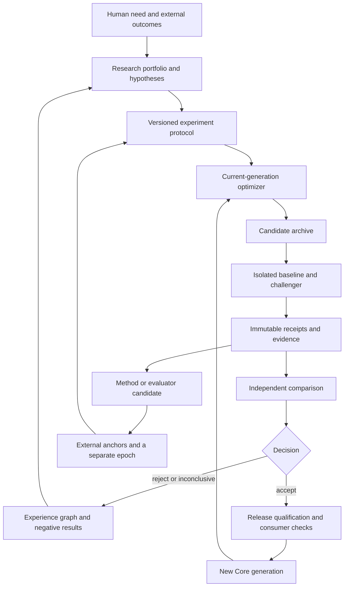

# Architecture for recursive self-improvement in Lokvetia Core

<!-- translation-metadata:start -->

Translation source and currency

Translation source: [core-architecture.md](core-architecture.md). Source SHA-256 (UTF-8/LF): `73efcbb7cc2e2cd5bb91265c2e9ff76cd29cff3fc0e0921fe48daaffef03d3dc`.

Currency checks: [Core](https://github.com/HappyMiha/Lokvetia-Core/actions/workflows/planning.yml?query=branch%3Amain) · [Lokiravia](https://github.com/HappyMiha/Lokiravia/actions/workflows/planning.yml?query=branch%3Amain). English is a documentation translation; canonical requirements and evidence statuses are unchanged.

<!-- translation-metadata:end -->

Українська: [original](core-architecture.md).

Status: proposed architecture, revision 2026-09-10. No new service in this document is considered implemented. Sources and factual limits: [audit](repository-audit.en.md), [RSI](rsi-source-analysis.en.md), [shared concept](vision.en.md).

## 1. Product boundary

**Core both carries out evolution and is an independent subject of evolution.** Improving a game world is one consumer scenario. The platform must have a separate Core-on-Core task set: context, routing, tool reliability, Core code and migrations, orchestration, operator UX, and the methodology of its own experiments.

The comparison subject is an exact system version: model/provider revision + prompts + skills + tools + memory view + orchestration + budgets + evaluation protocol. Unchanged model weights do not preclude real harness improvement. A new model alone is not evidence of Core self-improvement.

## 2. Four loops and their scales

| Loop | Subject and timescale | Input | Output | Location |
| --- | --- | --- | --- | --- |
| Task repair | One result, minutes | Task + feedback | Verified candidate or failure | Existing `EngineeringLoopService` |
| Core evolution | Component/product version, hours–days | Platform problem + experiment protocol | Generation comparison and release candidate | New orchestration layer over existing services |
| Method / evaluator evolution | How improvements are found and evaluated, epochs | Success/failure history + external anchors | New methodology or evaluator epoch | Core research portfolio, separate qualification |
| World evolution | State: ticks; rules: epochs | Player/NPC actions, state, playtest | Domain events or game-pack candidate | Game runtime + shared Core infrastructure |

A short task-repair loop does not rewrite its own completion criterion. A world tick does not wait for a research loop. The method may change between epochs, but its results are not retroactively recalculated under a more favorable criterion.

## 3. What we reuse

| Existing foundation | Extension | Boundary that must be retained |
| --- | --- | --- |
| AF-008 `engineering_loop.py` | Child run of one experiment | Caps/recovery; low-level `accepted_evidence=True` is not an independent evaluation receipt |
| AF-051 `candidate_changes.py` + AF-052 `validators.py` | Core source change as an immutable candidate | Exact diff/attempt identity, five software validator categories, immutable base |
| AF-020 `evaluation.py` | Typed evaluation subjects, comparison protocol, `inconclusive` in a new comparison layer | Old pass/fail API remains compatible; producer/reviewer separation is preserved |
| AF-016 `memory.py` | Experiment lineage, negative results, consumer impact | Existing scope/validity/authority; not a second source of truth |
| Governed skills and packs | Signed generation manifests, quarantine/revocation | External test receipts instead of self-reported assessment |
| Worktrees / qualification / sandbox | Self-hosted candidate runtime in a disposable environment | Candidate cannot modify the running supervisor, credentials, holdout, or receipts |
| ADR service | Architectural hypothesis, frame proposal, impact record | Goal changes have an author, evidence, and a new version |
| Execution telemetry / mission runtime | Experiment budget ledger and durable state machine | A completed attempt's result is not lost on restart |
| Core release + Lokiravia pin | Compatibility comparison and governed acceptance | New Core HEAD does not equal an accepted consumer version |

These are logical components. The first implementation does not require new microservices, a graph database, a second scheduler, or a Temporal rewrite. Begin with narrow contracts and existing storage boundaries; service separation depends on measured load and isolation requirements.

[Q02 identity continuity](identity-continuity.en.md) distinguishes a stable logical product from an exact execution generation and current principal. Migration checks the semantic meaning of rights/purpose and outcome projections; the candidate does not choose for itself which obligations to include. The [narrow source audit](implementation-identity-audit.en.md) shows which versioned role/memory primitives already exist and what locally reading these functions does not prove.

## 4. Candidate manifest and generation envelope

Before execution, create an immutable `CandidateManifest`: artifact/base/parent digests, composition, compatibility, protocol, capability scope, input/memory views, and planned migration/rollback. Runners receive its digest. After completion, a separate immutable `DecisionEnvelope` references the candidate digest, sealed experiment receipts, comparison, and decision; it does not change candidate bytes. The release `GenerationManifest` binds the accepted candidate to the decision envelope and qualification evidence. The mutable `active` alias updates an ActivationBinding with a monotonic sequence and references only a completed manifest; ActivationReceipt is recorded separately. Returning to an old digest does not restore old permissions.

The table below describes the combined fields of three related records; post-run evidence/decision fields are not the candidate's input identity. A correction creates a new record instead of adding a future outcome to an already hashed input.

| Field | Semantics |
| --- | --- |
| `generation_id`, `parent_ids`, `subject_kind` | Version and lineage; `core_product`, `harness`, `skill`, `tool`, `optimizer`, `evaluator`, `world_rules` |
| `artifact_digest`, `base_digest`, `manifest_digest` | Which bytes were compared; canonical serialization for config/skill |
| `compatibility` | Core/API/storage/pack schema versions, consumers, platform qualification |
| `model_identity` | Requested and effective model/provider; available version-pin precision is explicitly recorded |
| `memory_view_id`, `dataset_ids` | Snapshot/filtered view, permitted purpose, provenance, contamination tracking |
| `protocol_id`, `epoch_id`, `experiment_ids` | Immutable criteria for this comparison |
| `capability_scope` | Permitted tools/paths/costs; production credentials are absent from the experiment |
| `evidence_manifest`, `comparison_decision_id` | Post-run receipts, comparison, failures, dissent, reason for accepting the claim |
| `promotion_authorization_id` | Separate release record: exact release digest, expected ActivationBinding/sequence, authority epoch, target/profile, migration evidence, rollout scope; comparison does not grant this authority |
| `rollback_plan`, `migration_plan` | Return of runtime + compatible state, not merely an old Git SHA |
| `consent_scope`, `retention_policy` | Whether data may be used for shared learning, retention period |

The candidate archive retains rejected and inconclusive candidates as governed history; they may run only as isolated experiments. A revoked artifact cannot become active through reimport or an alias.

## 5. Experiment state and failures

`draft → protocol_frozen → admitted → running → evidence_sealed → compared → accepted | rejected | inconclusive | aborted`.

Orthogonal to phase, retain `runtime_disposition = active | paused | reconciling | stopped` and the evidence verdict/reason. Worker loss: phase=`running`, disposition=`reconciling`, result unknown until reconciliation. Hash mismatch: terminal `aborted`, reason=`subject_changed`, evidence verdict=`invalid`; these are not additional undeclared phase values. Transition to `evidence_sealed` requires reconciliation of every expected attempt; an unavailable receipt is recorded as missing after the deadline and does not become a pass. `compared` is possible only with a valid sealed set under the protocol; otherwise, aborted or inconclusive applies.

Accepted means “the improvement claim within this scope has been accepted,” not “deployed.” Separate release lifecycle: `candidate → qualified → shadow → canary → promoted → superseded | revoked`.

| Failure | Required behavior |
| --- | --- |
| Worker disappears after execution | Supervisor looks up the key only under a qualified receiver profile; without an observable outcome, status is unknown and a non-repeatable effect is not repeated autonomously |
| Verifier timeout | Timeout evidence retained; no pass by silence; retry consumes the overall budget |
| Crash after valid promotion authorization but before alias update | Durable promotion ID + CAS expected ActivationBinding/sequence and exact release digest; final commit serialized with revocation and renewed scope/state qualification checks. Comparison acceptance does not replace rollout permission; without it, the incumbent is preserved |
| Two candidates succeed concurrently | One alias CAS; the other is rebased/re-evaluated against the new base, without “last write wins” |
| Candidate changes validator/config during a run | Artifact/protocol hash mismatch; result invalid, all partial evidence preserved |
| Provider changes model without an exact version pin | Mark the confounder; repeat paired comparison or weaken the claim rather than attributing the difference to Core |
| Limit exceeded | Cancel child attempts, collect bounded-drain receipts, status aborted/inconclusive; candidate cannot raise the cap |
| Return to a version with an incompatible schema | A validated migration/restore plan is required, or rollout is not admitted; user state must be preserved |

Detailed transitions, receipt requirements, effect profiles, supervisor handoff, and 16 static crash scenarios appear in the [Q05 recovery contract](recovery-contract.en.md). They refine this scheme and do not attest to executed runtime tests.

Admission, task/attempt IDs, cancellation, and budgets must use existing Core mechanisms, including AF-GC-043. This is not a separate executor queue.

Shadow does not repeat an external action or make a second charge; its outputs are isolated. Canary has its own authorized target/audience and budget. Core's consumer regression gate concerns already supported APIs/profiles and does not wait for the future game or AF-CLD-020/034 to be complete. Lokiravia keeps its previous accepted pin until it separately qualifies the new Core: no circular readiness dependency exists between the products.

## 6. External evaluation protocol

Before execution, fix the primary outcome, constraints, baseline, sample, seeds, budget, attempt/holdout-view counts, decision rule, and stopping criterion. The comparison service does not accept arbitrary optimizer references to “success”: it receives sealed receipts from a trusted runner.

Three sets: visible development tasks; a sealed adaptive selection set; and a separate final confirmation set. The optimizer sees permitted diagnostic feedback, not hidden answers. Incorporating a holdout into skill memory contaminates the set: this is a lineage event and grounds for creating a new test set. The same test does not become new merely through an ID change.

**Q08 refined the pilot hypothesis:** [two non-game families](non-game-evaluation.en.md)—external bounded software maintenance and requirements-to-decision planning, with different work products and root/source corpora. Context, tool use, repair, recovery, and user-facing evidence are cross-cutting slices. The initial assumption of 60 paired tasks means 60 root-task pairs in one future confirmation block, approximately 30 per family; D/S preparation and search are separate work. Three stochastic repetitions are a noise-design hypothesis, not three independent tasks. All figures require precision/resource review before execution; this pass has no actual corpus/qualification/compute. Root ancestry, exposure, reference R0/Rn, repetitions/looks, and negative results remain explicit.

Initial rule: no hard-invariant violations; improvement on the preselected primary axis with sufficient specified statistical evidence; satisfied non-inferiority floors for other axes, an absolute cost cap, and consumer constraints. For a quality experiment, the primary outcome may be accepted-outcome rate; for efficiency, total cost at non-degraded quality; for reliability, recovery success. Example quality protocol: a positive lower bound of a preselected 95% paired interval. Method, margin, floors, permitted secondary tradeoffs, and handling of repeated comparisons are fixed **before** data. An uncertain result is `inconclusive`, not “almost success.” A larger sample does not promise a universal guarantee.

Controls: incumbent without evolution; incumbent with the same extra compute/resampling; challenger without the new memory/skill; new optimizer on a new domain. Mechanism and outcome evaluation are separate. Manipulated reporting, discarded failure cases, or replacing actual execution with a synthetic fixture invalidate the claim regardless of score.

The [Q06 comparison protocol](counterfactual-evaluation.en.md) specifies the experimental subject: replay restores history; action intervention changes an action; planner comparison changes Core's own component under identical initial observable inputs and permits different downstream actions. Public authored scenarios are development evidence. Evaluator candidates assess one frozen corpus with external labels; more events do not replace the user goal or causal contribution.

The [Q01 experience contract](experience-improvement.en.md) adds negative controls for source/harness/evaluator self-evolution: a hidden functional effect under a cosmetic label, pending output after opt-out, shifted costs, and evaluation only of those who stayed. The domain pack defines category meanings; Core checks versioned scope, actual receipts, and the permissible claim scope. Increased task success with insufficient benefit to the owner may justify an abandon/change proposal; the same optimizer does not silently accept a new product goal.

## 7. Recursion: changing the improvement mechanism

Optimizer O0 creates candidate optimizer O1; an external protocol accepts or rejects O1. Both receive the same new task portfolio and budget and produce child **product** candidates. Compare accepted useful improvements, coverage, time-to-evidence, cost, regressions, and the proportion of honestly terminated unsuccessful directions. This is evidence of optimizer improvement.

A stronger recursive-method claim requires typed lineage `O0 → proposed O1 → independently accepted O1 → O1-produced optimizer/method O2`. O2 changes the improvement method itself, rather than merely being a better task artifact. A separate fresh comparison against immediate accepted O1 must establish its usefulness; lineage alone proves participation in the loop, not gain. A receipt of actual use of the changed method is required, not merely its new file. O2 failure is preserved as failure; it neither erases O1's local improvement nor permits claiming every generation is better.

Recursive gain may be claimed only within measured transfer. If G1 merely solves familiar tasks better, accept task improvement, not method improvement. If the goal changed between generations, scores from different epochs are not joined into one “intelligence is growing” curve.

Core may propose changes to its own source/runtime, UI, planner, tool interfaces, memory policies, and research scheduler. There is no permanently forbidden category of “its own code.” Evidence requirements and promotion boundaries differ: an isolated candidate runtime has no right to directly modify the incumbent control process.

## 8. Evaluator evolution without self-approval

Evaluator `E_n` is fixed in epoch n. Candidate `E_n+1` is evaluated against an externally adjudicated corpus, old regressions, hidden adversarial cases, blind response order, and disagreement slices. The incumbent evaluator is one witness, not an eternal arbiter of truth. If it is systematically wrong, independent adjudication and external anchors may justify replacement.

Initially, `E_n+1` runs in shadow. Both assessments and the disagreement matrix are preserved. A separate decision opens the new epoch with an objective version, reason, calibration evidence, and cross-epoch bridge set. Generator and evaluator do not approve each other in one undivided loop. A different model name or role in a prompt does not guarantee independence; separate authority, uncontaminated data, and external anchors are required.

Basic user rights, evidence integrity, privacy boundaries, budget, and the stopping mechanism are not covertly optimized together with reward. A proposal to change them belongs to an explicit owner product decision with a separate impact review. This allows the frame to change without changing it silently.

[Q03 evaluator succession](evaluator-succession.en.md) defines criterion dependencies, coherent cutover, and rebuilding the current selection view without erasing history. A0/A1 treatment is separate from the task generator; the frozen prior-access snapshot is separate from the ledger of subsequent accesses. Old scores, late receipts, costs, and archive eligibility have different semantics. Ten open static controls refine the criteria; primary DGM/RQGM methods are not evidence of executed Core RSI.

## 9. Experience graph and long-term memory

The graph indexes relationships between existing records: `problem → hypothesis → protocol → candidate → run → outcome → decision → generation → consumer`. Additional relationships: contradicts, supersedes, invalidates, reused-by, confounded-by. Authoritative evidence remains in the existing evidence store; a graph edge does not increase its authority.

Every distilled skill contains applicability, counterexamples, invalidation conditions, suite/version, failure data, and bounded resource cost. A new skill has the existing lifecycle state `draft`. Security quarantine is a separate admission verdict/record, not a new GovernedSkillService enum. Transition to `approved` requires external receipts and no blocking quarantine; any enum extension is a separate compatible change. Revocation finds direct and transitive derivatives, closes future retrieval, and creates remediation tasks; actions already performed are not automatically “unperformed.”

Personal data is separate from technical lineage. A tombstone may confirm that a source was deleted without restoring its content. Cross-tenant learning uses only a permitted purpose and opt-in artifacts; consent to play is not consent to shared training. Retention is a product policy, not a promise to store everything forever.

## 10. Core as a product, not merely a benchmark

The product research portfolio collects observed friction, failed tasks, support themes, and direct interviews. A hypothesis must identify whom it helps, which uncertainty it reduces, the “change nothing” alternative, and evidence that would refute it. Estimated value-of-information helps allocate budget but is not measured benefit.

Possible frame revision: Core has been learning to produce more detailed plans, but observations show users becoming lost and never reaching execution. The system proposes shortening the plan and changing the primary outcome to a clear next decision. The old completeness metric may fall; product quality is not reducible to maximizing an old metric. The new goal is approved as a new version while preserving accessibility, transparency, and task-success constraints.

Optional [Q04 training research](training-research.en.md) adds separate identities for research/controller, target model, trainer/data/recipe, and serving bundle. Reference substrate and standing policy are not conflated; internal selection strategy may evolve as treatment under a shared external criterion. Feasibility, permission for a specific bounded pilot, and adoption after actual outcomes are separate decisions. A new model checkpoint does not itself prove improvement in the researcher, Core workflow, or O0→O1→O2.

## 11. Metrics and economic boundary

| Metric | Calculation / source | Use |
| --- | --- | --- |
| Accepted outcome rate | Outcomes accepted by an independent protocol / all planned eligible cases | Primary quality within the protocol version |
| Cost per accepted improvement | Generation + failed runs + verification + human review + storage / accepted improvements | If denominator=0: “no accepted improvements,” not zero cost |
| Regression surface | Failures by family/platform/consumer, including non-game Core | The average score must not hide a critical slice |
| Method transfer | Difference in quality of G1 versus G0 child candidates on new tasks under equal budgets | Evaluation of the recursive claim |
| Recovery integrity | Recovered compatible states / planned drill cases, time and loss | Promotion gate, not decorative uptime |
| Evidence integrity | Missing, tampered, stale, contaminated receipts / all receipts | Hard failure wherever evidence is required |
| Portfolio diversity | Covered problem families, concentration, abandoned/negative hypotheses | A signal of stagnation, not maximization of random novelty |
| User outcome | Completed task, clarity of the next step, agency, recurring usefulness | Product grounding and frame review |

An experiment has an absolute token/time/cost/storage budget and bounded fan-out. Child agents consume the shared limit; a failed attempt also costs resources. The pilot starts with a small caps profile agreed before real expenditure. This document specifies neither fixed commercial prices nor a promised speedup.

## 12. ADR decisions in this revision

| ADR | Decision | Rejected alternative / consequence | Review condition |
| --- | --- | --- | --- |
| EV-001 | Shared evolution infrastructure in Core; Core is its own subject | Two independent Evolution Engines would cause evidence and authority to diverge | An independent product lifecycle requires a justified fork, not simple renaming |
| EV-002 | Experiment supervisor separate from mutable candidate | Hot self-editing makes results incomparable and recovery unreliable | A demonstrated stronger isolation boundary with equivalent provenance |
| EV-003 | Evaluator fixed within an epoch, separate evaluator succession | Joint uncontrolled co-approval encourages score inflation | A new externally validated protocol |
| EV-004 | Experience graph projects existing memory/evidence | A second storage authority creates scope/invalidation divergence | Measured need for different storage with a migration contract |
| EV-005 | Gameplay state and world-rule release are different transactions | Arbitrary dialogue cannot install new executable code | A demonstrated new domain language with a bounded verifier |
| EV-006 | Novelty, user value, correctness, and cost are separate axes | One engagement score hides loss of agency and more expensive experiments | Human research justifies a new system of criteria |

**EV-007 (Q05):** activation is a versioned capability boundary: monotonic sequence, serialized grant/revocation, immutable activation receipt, coherent state binding, and an explicit boundary for external effect profiles. [Rationale and verification conditions](recovery-contract.en.md).

The initial delivery is contracts + offline Core-on-Core experiment design. Real training runs, production self-modification, a public game world, and data migrations begin only through a separately requested implementation.
