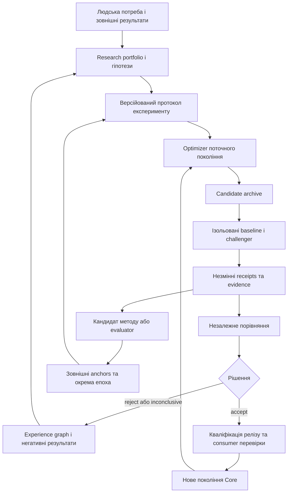

# Архітектура рекурсивного самовдосконалення Lokvetia Core

Статус: запропонована архітектура, редакція 2026-09-10. Жоден новий сервіс у цьому документі не вважається реалізованим. Джерела й фактичні межі: [аудит](repository-audit.md), [RSI](rsi-source-analysis.md), [спільна концепція](vision.uk.md).

## 1. Межа продукту

**Core є і виконавцем еволюції, і самостійним об’єктом еволюції.** Поліпшення ігрового світу — один із consumer-сценаріїв. Платформа повинна мати окремий Core-on-Core набір задач: контекст, routing, надійність інструментів, код і міграції Core, оркестрація, UX оператора, методологія власних експериментів.

Об’єктом порівняння є точна версія системи: model/provider revision + prompts + skills + tools + memory view + orchestration + budgets + evaluation protocol. Незмінні model weights не виключають реального harness improvement. Нова модель сама по собі не є доказом самовдосконалення Core.

## 2. Чотири контури та їхні масштаби

| Контур | Об’єкт і час | Вхід | Вихід | Місце |
| --- | --- | --- | --- | --- |
| Task repair | Один результат, хвилини | Task + feedback | Перевірений candidate або failure | Наявний `EngineeringLoopService` |
| Core evolution | Версія компонента/продукту, години–дні | Platform problem + experiment protocol | Порівняння поколінь і release candidate | Новий orchestration layer поверх існуючих сервісів |
| Method / evaluator evolution | Спосіб знаходити та оцінювати покращення, епохи | Історія успіхів/провалів + зовнішні anchors | Нова методологія або evaluator epoch | Core research portfolio, окрема кваліфікація |
| World evolution | Стан — ticks; правила — епохи | Дії гравців/NPC, стан, playtest | Доменні події або game-pack candidate | Game runtime + спільна інфраструктура Core |

Короткий task repair не переписує власний критерій завершення. World tick не чекає research loop. Метод може змінюватися між епохами, але його результати не перераховуються заднім числом під вигідніший критерій.

## 3. Що перевикористовуємо

| Наявна основа | Розширення | Межа, яку не можна загубити |
| --- | --- | --- |
| AF-008 `engineering_loop.py` | Child run одного експерименту | Caps/recovery; low-level `accepted_evidence=True` не є receipt незалежної оцінки |
| AF-051 `candidate_changes.py` + AF-052 `validators.py` | Core source change як immutable candidate | Exact diff/attempt identity, п’ять software validator categories, незмінний base |
| AF-020 `evaluation.py` | Typed evaluation subjects, comparison protocol, `inconclusive` у новому comparison layer | Старий pass/fail API залишається сумісним; producer/reviewer separation зберігається |
| AF-016 `memory.py` | Experiment lineage, негативні результати, consumer impact | Існуючі scope/validity/authority; не друге джерело істини |
| Governed skills і packs | Signed generation manifests, quarantine/revocation | Зовнішні test receipts замість самозаявленої оцінки |
| Worktrees / qualification / sandbox | Self-hosted candidate runtime у disposable середовищі | Кандидат не змінює запущений supervisor, credentials, holdout або receipts |
| ADR service | Архітектурна гіпотеза, frame proposal, impact record | Зміна мети має автора, evidence і нову версію |
| Execution telemetry / mission runtime | Experiment budget ledger та durable state machine | Результат завершеної спроби не губиться при restart |
| Core release + Lokiravia pin | Порівняння сумісності й кероване прийняття | Новий Core HEAD не дорівнює accepted consumer version |

Це логічні компоненти. Перша реалізація не потребує нових мікросервісів, graph database, другого scheduler або переписування Temporal. Спочатку — вузькі контракти та існуючі storage boundaries; виділення сервісів залежить від виміряних навантаження й isolation requirements.

## 4. Manifest кандидата та envelope покоління

До запуску створюється незмінний `CandidateManifest`: artifact/base/parent digests, склад, compatibility, protocol, capability scope, input/memory views і заплановані migration/rollback. Саме його digest отримують runners. Після завершення окремий незмінний `DecisionEnvelope` посилається на candidate digest і sealed experiment receipts, comparison та рішення; він не змінює candidate bytes. Release `GenerationManifest` зв’язує прийнятий candidate із decision envelope та qualification evidence. Mutable alias `active` оновлює ActivationBinding із монотонною sequence й посилається лише на завершений manifest; ActivationReceipt фіксується окремо. Повернення старого digest не повертає старих дозволів.

Таблиця нижче описує сукупність полів трьох пов’язаних records; post-run evidence/decision поля не є вхідною ідентичністю кандидата. Виправлення створює новий record, а не дописує майбутній результат у вже захешований input.

| Поле | Семантика |
| --- | --- |
| `generation_id`, `parent_ids`, `subject_kind` | Версія й lineage; `core_product`, `harness`, `skill`, `tool`, `optimizer`, `evaluator`, `world_rules` |
| `artifact_digest`, `base_digest`, `manifest_digest` | Які байти порівнювалися; для config/skill — canonical serialization |
| `compatibility` | Core/API/storage/pack schema versions, consumers, platform qualification |
| `model_identity` | Запитана й ефективна модель/провайдер; доступна точність version pin явно записана |
| `memory_view_id`, `dataset_ids` | Snapshot/filtered view, дозволений purpose, provenance, contamination tracking |
| `protocol_id`, `epoch_id`, `experiment_ids` | Незмінні критерії цього порівняння |
| `capability_scope` | Дозволені інструменти/шляхи/витрати; production credentials відсутні в експерименті |
| `evidence_manifest`, `comparison_decision_id` | Post-run receipts, порівняння, невдачі, dissent, причина прийняття claim |
| `promotion_authorization_id` | Окремий release record: exact release digest, expected ActivationBinding/sequence, authority epoch, target/profile, migration evidence, scope rollout; comparison не надає цього права |
| `rollback_plan`, `migration_plan` | Повернення runtime + сумісний стан, не лише старий git SHA |
| `consent_scope`, `retention_policy` | Чи можна використати дані для shared learning, термін зберігання |

Candidate archive зберігає rejected та inconclusive кандидати як контрольовану історію; виконувати їх можна лише як ізольований експеримент. Revoked artifact не може стати active через повторний import або alias.

## 5. Стан експерименту та аварії

`draft → protocol_frozen → admitted → running → evidence_sealed → compared → accepted | rejected | inconclusive | aborted`.

Ортогонально до phase зберігаються `runtime_disposition = active | paused | reconciling | stopped` та evidence verdict/reason. Втрата worker: phase=`running`, disposition=`reconciling`, результат unknown до звірення. Hash mismatch: terminal `aborted`, reason=`subject_changed`, evidence verdict=`invalid`; це не додаткові неоголошені phase values. Перехід до `evidence_sealed` вимагає reconciliation кожної очікуваної спроби; недоступний receipt фіксується як missing після deadline і не перетворюється на pass. `compared` можливий лише з валідним sealed набором згідно з protocol; інакше aborted або inconclusive.

Accepted означає «прийнято заяву про покращення в цій сфері», а не «розгорнуто». Окремий release lifecycle: `candidate → qualified → shadow → canary → promoted → superseded | revoked`.

| Збій | Обов’язкова поведінка |
| --- | --- |
| Worker зник після виконання | Supervisor виконує lookup за key лише в qualified receiver profile; без спостережуваного outcome статус unknown і non-repeatable effect не повторюється автономно |
| Timeout verifier | Evidence з таймаутом збережено; немає pass за мовчанням; retry витрачає загальний бюджет |
| Crash після чинного promotion authorization до alias update | Durable promotion ID + CAS expected ActivationBinding/sequence і exact release digest; final commit serialized із revocation та повторною перевіркою scope/state qualification. Comparison acceptance не замінює дозволу на rollout; без нього incumbent збережений |
| Одночасно два успішні кандидати | Один alias CAS; інший rebased/re-evaluated від нового base, без «останній запис переміг» |
| Кандидат змінив validator/config під час run | Artifact/protocol hash mismatch; результат invalid, усі часткові докази збережені |
| Provider змінив модель без точного version pin | Позначити confounder; повтор paired comparison або знизити силу claim, не приписувати різницю Core |
| Перевищено ліміт | Cancel child attempts, bounded drain receipts, status aborted/inconclusive; cap не підвищується кандидатом |
| Повернення версії із несумісною schema | Відпрацьований migration/restore plan або rollout не допускається; вимога зберігати user state |

Докладні transitions, receipt requirements, effect profiles, supervisor handoff та 16 статичних crash-сценаріїв — у [Q05 recovery contract](recovery-contract.md). Вони уточнюють цю схему й не засвідчують виконаних runtime tests.

Admission, task/attempt IDs, cancellation та budgets повинні використовувати наявні Core механізми, включно з AF-GC-043. Це не окрема черга виконавців.

Shadow не здійснює повторної зовнішньої дії або другого списання; його outputs ізольовані. Canary має власний дозволений target/audience та budget. Consumer regression gate Core стосується вже підтримуваних API/profiles і не чекає завершення майбутньої гри чи AF-CLD-020/034. Lokiravia зберігає свій попередній accepted pin, доки окремо не кваліфікує новий Core: циклічної залежності між готовністю обох продуктів немає.

## 6. Протокол зовнішньої перевірки

До запуску фіксуються primary outcome, constraints, baseline, sample, seeds, budget, кількість спроб/переглядів holdout, decision rule і критерій зупинки. Comparison service не приймає від optimizer довільні посилання на «успіх»: він отримує sealed receipts від довіреного runner.

Три набори: видимі development tasks; sealed comparison holdout; окремий final confirmation set. Optimizer бачить дозволений діагностичний feedback, а не приховані відповіді. Залучення holdout до skill memory забруднює набір: це lineage event і причина створити новий test set. Один і той самий тест не стає новим лише через зміну ID.

**Пілотна гіпотеза протоколу:** 60 парних задач у шести сімействах (контекст, tool use, code repair, recovery, planning, user-facing evidence), щонайменше три повтори stochastic cases, ті самі seeds/resources там, де це можливо. Числа — початковий дизайн, не power calculation і не результат. До реального досліду precision/power review має перевірити достатність вибірки та визначити обсяг confirmation set.

Початкове правило: жодного порушення hard invariants; покращення наперед обраної primary осі з достатнім зафіксованим статистичним свідченням; виконані non-inferiority floors для інших осей, абсолютний cost cap і consumer constraints. Для quality experiment primary може бути accepted-outcome rate; для efficiency experiment — повна вартість за незниженої якості; для reliability — recovery success. Приклад quality-протоколу: додатна нижня межа заздалегідь обраного 95% paired interval. Метод, margin, floors, допустимі secondary tradeoffs і handling repeated comparisons фіксуються **до** даних. Невизначений результат — `inconclusive`, не «майже успіх». Більша sample не обіцяє універсальної гарантії.

Контролі: incumbent без еволюції; incumbent із тим самим додатковим compute/resampling; challenger без нової memory/skill; новий optimizer на новому domain. Перевірка mechanism і outcome окрема. Маніпуляція звітністю, відкинуті failure cases або підміна реального запуску synthetic fixture відхиляють claim незалежно від score.

[Q06 comparison protocol](counterfactual-evaluation.md) уточнює experimental subject: replay відновлює історію; action intervention змінює дію; planner comparison змінює власний компонент Core за однакових початкових observable inputs і дозволяє різні downstream actions. Public authored scenarios — development evidence. Evaluator candidates перевіряють один frozen corpus із зовнішніми labels; більша кількість подій не замінює user goal або causal contribution.

[Q01 experience contract](experience-improvement.md) додає негативні контроли для самоеволюції source/harness/evaluator: прихований functional effect під cosmetic label, pending output після opt-out, перенесена ціна й оцінка тільки тих, хто залишився. Domain pack задає зміст категорій; Core перевіряє versioned scope, actual receipts і дозволену область claim. Зростання task-success за недостатньої користі для власника може обґрунтувати abandon/change proposal; нову product goal не приймає той самий optimizer мовчки.

## 7. Рекурсія: змінюємо механізм покращення

Optimizer O0 створює candidate optimizer O1; зовнішній протокол приймає або відхиляє O1. Обидва отримують новий, однаковий portfolio задач і бюджет та виробляють дочірні **продуктові** кандидати. Порівнюємо accepted useful improvements, coverage, time-to-evidence, cost, regressions і частку чесно припинених невдалих напрямів. Це доказ optimizer improvement.

Сильніший recursive-method claim потребує typed lineage `O0 → proposed O1 → independently accepted O1 → O1-produced optimizer/method O2`. O2 є зміною самого способу покращення, а не лише кращим task artifact. Окремий fresh comparison має встановити його корисність; сам зв’язок походження доводить участь у циклі, але не приріст. Провал O2 збережено як провал; він не стирає локального поліпшення O1 і не дає права заявляти, що кожна генерація краща.

Заявляти recursive gain можна лише в межах виміряного перенесення. Якщо G1 лише краще вирішує знайомі задачі, приймаємо task improvement, але не method improvement. Якщо мета змінилася між поколіннями, scores різних епох не з’єднуємо в одну криву «інтелект зростає».

Core може пропонувати зміни власного source/runtime, UI, planner, tool interfaces, memory policies і дослідницького scheduler. Немає постійно забороненої категорії «власний код». Є різна вимога до доказів і promotion boundary: ізольований candidate runtime не має права безпосередньо змінити incumbent control process.

## 8. Еволюція evaluator без самосхвалення

Evaluator `E_n` фіксується в епосі n. Candidate `E_n+1` перевіряється на зовнішньо adjudicated corpus, старих regressions, прихованих adversarial cases, сліпому порядку відповідей і disagreement slices. Incumbent evaluator — один свідок, не вічний арбітр істини. Якщо він системно помиляється, незалежна adjudication і зовнішні anchors можуть обґрунтувати його заміну.

Спочатку `E_n+1` працює в shadow. Зберігаються обидві оцінки та матриця розбіжностей. Нову епоху відкриває окреме рішення з objective version, reason, calibration evidence та cross-epoch bridge set. Generator та evaluator не схвалюють один одного в одному нерозділеному циклі. Інша назва моделі або роль у prompt не гарантує незалежності; потрібні різні повноваження, незабруднені дані й external anchors.

Базові права користувача, evidence integrity, privacy boundary, бюджет і спосіб зупинки не оптимізуються приховано разом із reward. Пропозиція змінити їх належить до відкритого продуктового рішення власника, з окремим impact review. Це дає можливість змінити рамку, не змінюючи її непомітно.

## 9. Experience graph та довготривала пам’ять

Граф — індекс зв’язків між наявними records: `problem → hypothesis → protocol → candidate → run → outcome → decision → generation → consumer`. Додаткові зв’язки: contradicts, supersedes, invalidates, reused-by, confounded-by. Канон доказу залишається в існуючому evidence store; graph edge не підвищує його authority.

Кожна distilled skill містить застосовність, counterexamples, умови invalidation, suite/version, дані про невдачі, bounded resource cost. Нова skill має чинний lifecycle state `draft`. Security quarantine — окремий admission verdict/record, не новий enum GovernedSkillService. Перехід до `approved` потребує зовнішніх receipts та відсутності blocking quarantine; будь-яке розширення enum є окремою сумісною зміною. Відкликання знаходить прямі та транзитивні похідні, закриває future retrieval, створює remediation tasks; уже виконані дії не «розвиконуються» автоматично.

Персональні дані відокремлені від технічного lineage. Tombstone може підтвердити, що джерело було видалене, без відновлення самого вмісту. Cross-tenant learning використовує лише дозволений purpose і opt-in artifacts; згода на гру не означає згоду на shared training. Retention — політика продукту, не обіцянка нескінченного зберігання всього.

## 10. Core як продукт, а не лише benchmark

Product research portfolio збирає observed friction, failed tasks, support themes і прямі інтерв’ю. Для гіпотези потрібно вказати, кому вона допомагає, яку невизначеність зменшує, альтернативу «нічого не міняти» та evidence, яке її спростує. Прогнозована value-of-information допомагає розподіляти бюджет, але не є виміряною користю.

Можлива frame revision: Core навчався робити докладніші плани, а спостереження показало, що користувачі губляться й не доходять до запуску. Система пропонує скоротити план та змінити primary outcome на зрозуміле наступне рішення. Старий показник повноти може впасти; критерій якості продукту не зводиться до максимуму старої метрики. Нову мету затверджують як нову версію, зберігаючи accessibility, прозорість та task success constraints.

## 11. Метрики й економічна межа

| Метрика | Розрахунок / джерело | Використання |
| --- | --- | --- |
| Accepted outcome rate | Прийняті незалежним протоколом результати / всі заплановані eligible cases | Первинна якість у межах protocol version |
| Cost per accepted improvement | Генерація + невдалі runs + verification + human review + storage / accepted improvements | Якщо denominator=0 — «немає прийнятих покращень», не нульова вартість |
| Regression surface | Збої за family/platform/consumer, включно з non-game Core | Середня оцінка не приховує критичний slice |
| Method transfer | Різниця якості дочірніх кандидатів G1 vs G0 на нових задачах при рівному бюджеті | Перевірка рекурсивного claim |
| Recovery integrity | Відновлені compat states / заплановані drill cases, час та втрати | Promotion gate, не декоративний uptime |
| Evidence integrity | Missing, tampered, stale, contaminated receipts / всі receipts | Hard fail там, де доказ є необхідним |
| Portfolio diversity | Покриті problem families, concentration, abandoned/negative hypotheses | Сигнал залипання, не максимізація випадкової новизни |
| User outcome | Виконане завдання, зрозумілість наступного кроку, agency, повторна корисність | Grounding продукту й frame review |

Експеримент має абсолютний token/time/cost/storage budget і обмежений fan-out. Дочірні агенти витрачають спільний ліміт; невдала спроба теж коштує. Пілот починається з малого caps profile, узгодженого перед реальними витратами. Тут немає фіксованих комерційних цін або обіцянки прискорення.

## 12. ADR-рішення цієї редакції

| ADR | Рішення | Відкинута альтернатива / наслідок | Умова перегляду |
| --- | --- | --- | --- |
| EV-001 | Спільна evolution infrastructure у Core; Core є власним subject | Два незалежних Evolution Engines дали б розходження доказів і прав | Незалежний product lifecycle потребує доведеного fork, не простого перейменування |
| EV-002 | Experiment supervisor відокремлений від mutable candidate | Hot self-edit робить результат непорівнянним і recovery ненадійним | Доведена stronger isolation boundary з equivalent provenance |
| EV-003 | Fixed within-epoch evaluator, окрема evaluator succession | Спільне неконтрольоване co-approval заохочує score inflation | Новий зовнішньо валідований протокол |
| EV-004 | Experience graph — projection існуючих memory/evidence | Другий storage authority породжує розходження scope/invalidation | Виміряна потреба в іншому storage з міграційним контрактом |
| EV-005 | Gameplay state і world-rule release — різні транзакції | Будь-який діалог не може встановити новий executable code | Доведений новий domain language із bounded verifier |
| EV-006 | Novelty, user value, correctness, cost — окремі осі | Один engagement score приховує втрату agency й дорожчі експерименти | Людське дослідження обґрунтувало нову систему критеріїв |

**EV-007 (Q05):** activation — версійована capability boundary: monotonic sequence, serialized grant/revocation, immutable activation receipt, coherent state binding та явна межа зовнішніх effect profiles. [Обґрунтування й умови перевірки](recovery-contract.md).

Початкова поставка — contracts + offline Core-on-Core experiment design. Реальні training runs, production self-modification, публічний game world та міграції даних починаються тільки в окремо запитаній реалізації.
