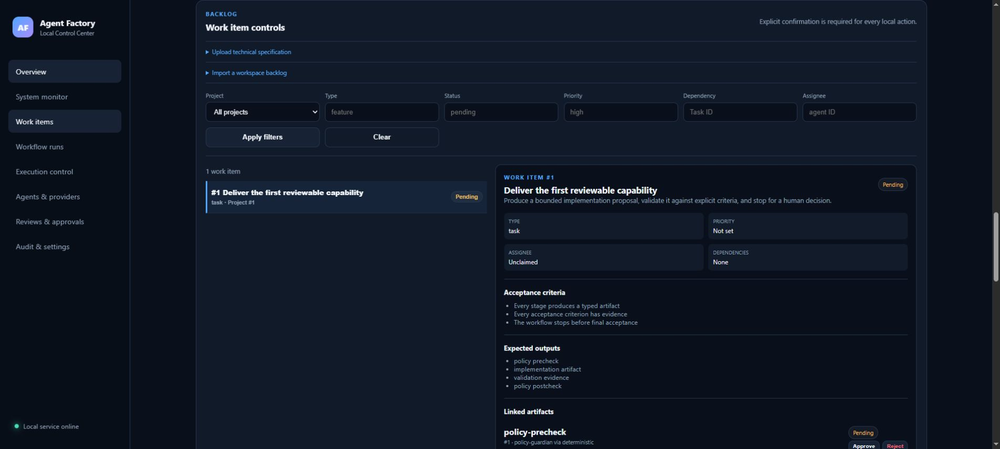
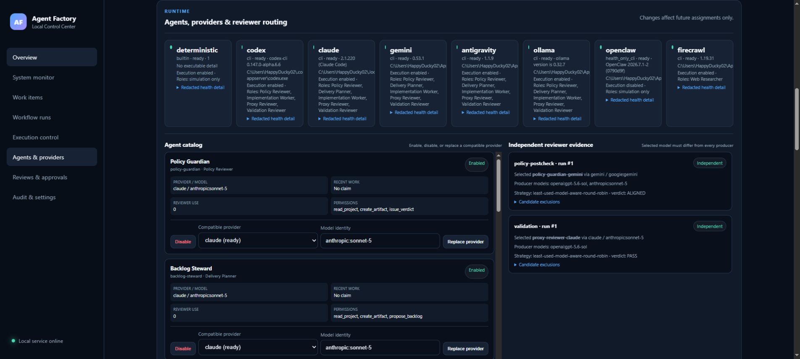
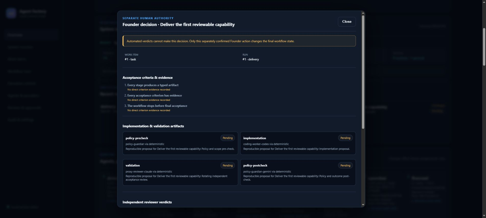
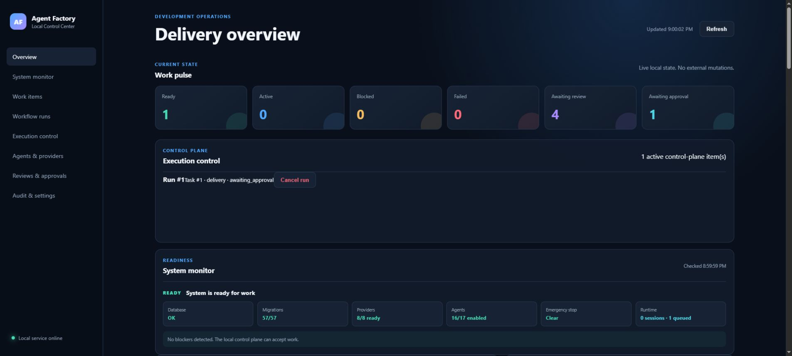
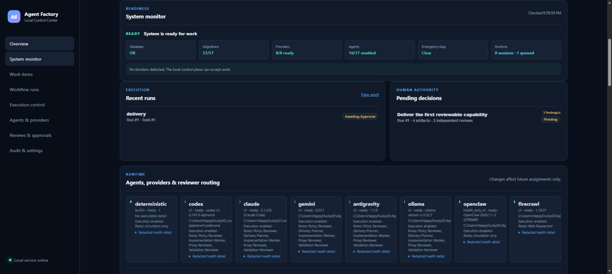
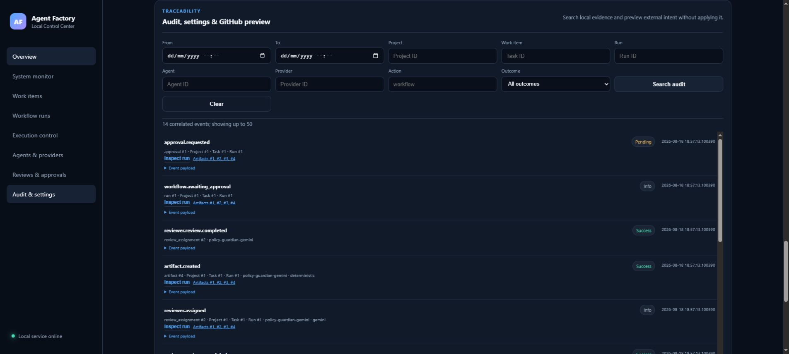
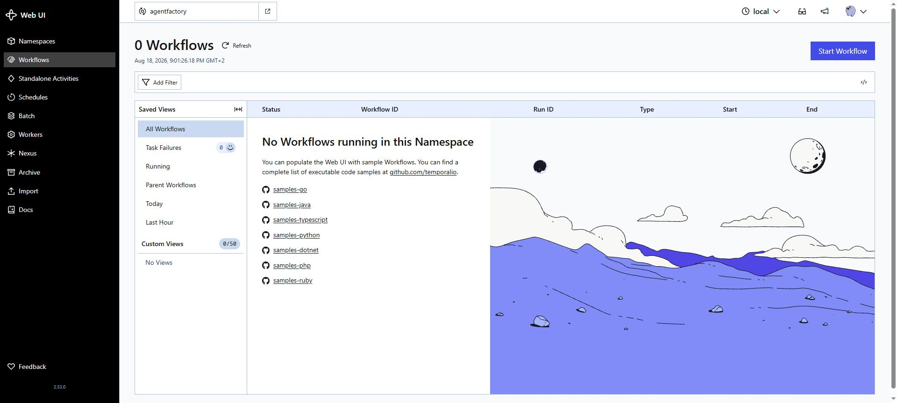

# N0DRA: повний посібник оператора

Версія посібника: 18 серпня 2026 року. Команди перевірено на Windows PowerShell у поточному репозиторії.

N0DRA координує локальну AI-розробку, зберігає проєкти, backlog, запуски, артефакти, рев'ю та аудит у SQLite, а Temporal забезпечує довговічне виконання. Команда й Python-пакет досі називаються `agent-factory` та `agent_factory` для сумісності. Реальна мутація коду, provider-виклик, GitHub-операція і фінальне прийняття залишаються окремими контрольованими діями.

## 1. Що вже працює і де межі

| Можливість | Стан | Як користуватися |
|---|---|---|
| Створення проєкту та задач | Готово | CLI або REST API |
| Імпорт технічної специфікації/backlog | Готово | Local Control Center або CLI |
| Офлайн workflow без витрат | Готово | `simulation`; створює типізовані артефакти й незалежні рев'ю |
| Реальний запуск Codex/Claude/Gemini/Antigravity/Ollama | Готово, із gate | Один provider + agent + task на одноразове людське погодження |
| Довговічний workflow | Готово | Temporal Server у Docker, Worker на Windows host |
| Restart/retry/heartbeat/cancel | Готово | Temporal відновлює workflow з останньої завершеної Activity |
| Агентна перевірка | Готово | Reviewer-модель відрізняється від моделі-виробника; verdict та evidence зберігаються |
| Фінальне прийняття | Лише людина | Founder approval не може видати агент |
| Автономний live multi-stage без жодних gates | Навмисно не дозволено | Не обходьте approval boundary; автономний контур працює до Founder gate |
| Автоматичний merge/push/release | Навмисно не дозволено | GitHub plan спочатку dry-run, зовнішня мутація потребує окремого gate |

Отже, «самостійний режим з верифікацією агентами» означає: фабрика без нагляду виконує дозволені етапи, повтори, repair та незалежні рев'ю, але зупиняється перед остаточним прийняттям або зовнішньою мутацією. Це не недолік, а зафіксована межа безпеки.

## 2. Передумови

- Windows 10/11, PowerShell 7 або Windows PowerShell.
- Git і Python 3.11+ (рекомендовано Python 3.12).
- Docker Desktop для Temporal.
- Для live-режиму: встановлений і автентифікований потрібний CLI (`codex`, `claude`, `gemini`, `agy`, `ollama`).
- Ключі й токени зберігайте у профілі провайдера або OS keyring, не в workflow input, логах чи `.env`.

## 3. Встановлення з нуля

У корені репозиторію:

```powershell
py -3.12 -m venv .venv
& .\.venv\Scripts\python.exe -m pip install --upgrade pip
& .\.venv\Scripts\python.exe -m pip install -e ".[dev,web]"
& .\.venv\Scripts\agent-factory.exe env check
& .\.venv\Scripts\python.exe -m unittest discover -s tests -v
```

Якщо extras у вашому shell інтерпретуються неправильно, залишайте лапки навколо `.[dev,web]`. Temporal SDK є основною залежністю пакета, тому окремого extra для нього немає.

## 4. Налаштування

Скопіюйте `.env.example` у власний локальний спосіб запуску або задайте змінні в PowerShell. Мінімальний набір для durable-режиму:

```powershell
$env:AGENT_FACTORY_WORKSPACE = (Get-Location).Path
$env:AGENT_FACTORY_DB = ".agent-factory/state.db"
$env:TEMPORAL_ENABLED = "true"
$env:TEMPORAL_ADDRESS = "localhost:7233"
$env:TEMPORAL_NAMESPACE = "agentfactory"
$env:TEMPORAL_TASK_QUEUE = "agentfactory-main"
$env:TEMPORAL_UI_URL = "http://localhost:8080"
$env:AGENTFACTORY_MAX_REPAIR_ITERATIONS = "5"
```

`TEMPORAL_ENABLED=false` залишає старий синхронний режим. При `true` фабрика не має мовчки перейти в non-durable режим: відсутній Temporal повинен дати зрозумілу помилку.

Перевірити ефективне середовище та провайдери:

```powershell
& .\.venv\Scripts\agent-factory.exe env check
& .\.venv\Scripts\agent-factory.exe providers status
& .\.venv\Scripts\agent-factory.exe agents list
```

Ролі, workflows, providers і policies беруться з `config/` або з каталогу `AGENT_FACTORY_CONFIG_DIR`. Allowlisted числові runtime settings можна змінювати у вебсекції **Audit & settings**; секрети та довільні shell-аргументи UI не приймає.

## 5. Запуск фабрики

### 5.1 Запустити Temporal

```powershell
.\infra\temporal\start.ps1
.\infra\temporal\health.ps1
```

Очікувані адреси:

- Temporal gRPC: `localhost:7233`
- Temporal UI: `http://localhost:8080/namespaces/agentfactory/workflows`
- namespace: `agentfactory`
- task queue: `agentfactory-main`

`stop.ps1` не видаляє історію. Лише `reset.ps1` видаляє volume і вимагає підтвердження або `-Force`.

### 5.2 Запустити Worker на Windows host

В окремому PowerShell з тими самими змінними середовища:

```powershell
& .\.venv\Scripts\agent-factory-temporal-worker.exe
```

Worker навмисно працює на host, щоб бачити PowerShell, Codex/Claude CLI, Git, Docker і локальні project folders.

### 5.3 Запустити Local Control Center

У третьому PowerShell:

```powershell
& .\.venv\Scripts\agent-factory.exe --workspace . web --host 127.0.0.1 --port 8765 --open
```

Без `--open` відкрийте `http://127.0.0.1:8765/` вручну. Зупинка: `Ctrl+C`.

## 6. Створити новий проєкт

### Варіант A: CLI

```powershell
& .\.venv\Scripts\agent-factory.exe --workspace . project init `
  --name "Doom Mini Game" `
  --description "Windows-compatible Doom-like mini game"

& .\.venv\Scripts\agent-factory.exe --workspace . project list
```

Запам'ятайте `id` проєкту. Потім створіть leaf task з тестованими критеріями:

```powershell
& .\.venv\Scripts\agent-factory.exe --workspace . work-item create `
  --project-id 1 `
  --kind task `
  --title "Vertical slice" `
  --description "Player health/mana, one level, weapons and monsters" `
  --acceptance "Build succeeds on Windows" `
  --acceptance "Automated tests pass" `
  --acceptance "README explains launch and controls"
```

### Варіант B: готовий backlog

```powershell
& .\.venv\Scripts\agent-factory.exe backlog validate --path .\backlog.json
& .\.venv\Scripts\agent-factory.exe backlog import --path .\backlog.json --project-id 1
& .\.venv\Scripts\agent-factory.exe work-item list --project-id 1
```

У вебінтерфейсі секція **Work items** дозволяє завантажити technical specification, імпортувати workspace backlog, фільтрувати задачі, бачити acceptance criteria, artifacts та runs. Створення самого project у поточній версії робиться CLI або REST API, а не окремою HTML-формою.



## 7. Безпечний dev-режим з верифікацією людини

Почніть із reproducible simulation. Вона не викликає зовнішню модель і не змінює GitHub:

```powershell
& .\.venv\Scripts\agent-factory.exe workflow run --task-id 1 --workflow delivery --mode simulation
```

Коли `TEMPORAL_ENABLED=true`, команда повертається після старту durable workflow; роботу виконує Worker. Коли `false`, workflow виконується синхронно.

Для одного реального provider-виклику спочатку перевірте discovery, потім створіть точний одноразовий gate:

```powershell
& .\.venv\Scripts\agent-factory.exe providers status
& .\.venv\Scripts\agent-factory.exe providers request gemini --agent coding-worker-gemini --task-id 1
& .\.venv\Scripts\agent-factory.exe providers gates
& .\.venv\Scripts\agent-factory.exe providers approve 1 --note "One bounded implementation proposal"
& .\.venv\Scripts\agent-factory.exe providers invoke 1
```

Після виконання людина перевіряє diff/code/tests, а потім окремо оцінює artifact:

```powershell
& .\.venv\Scripts\agent-factory.exe task review 1 --artifact-id 1 --decision approved --note "Evidence checked"
& .\.venv\Scripts\agent-factory.exe approvals list
& .\.venv\Scripts\agent-factory.exe approvals approve 1 --note "Acceptance criteria verified"
```

Gate споживається однією логічною спробою навіть при crash; для retry потрібен новий gate. Provider approval не є final workflow approval.

У стандартному coding route Codex є оркестратором і не створює додаткових задач для worker-ів. Gemini виконує implementation першим і закріплений за `gemini-3.1-pro-preview` з високим рівнем reasoning; якщо preview недоступний акаунту, CLI використовує `gemini-2.5-pro`, але headless-запуск N0DRA не погоджує перехід на Flash/Lite. Claude залишається standby та активується лише після явного вичерпання token/account quota Gemini. Після такого самого сигналу від Claude implementation продовжує Codex. Звичайна помилка коду, timeout, відсутній executable або тимчасовий HTTP 429 не перемикають кодера. Перемикання фіксується в audit trail і діє до завершення поточного durable run.

## 8. Самостійний запуск з агентною верифікацією

1. Увімкніть Temporal, запустіть Server і Worker.
2. Створіть project/task та чіткі acceptance criteria.
3. Запустіть `workflow run ... --mode simulation` для повністю автономного offline-проходу або видавайте bounded gates для дозволених live-етапів.
4. Не закривайте Temporal Server; Local Control Center можна перезапускати. Worker можна перезапустити - завершені Activities не запускаються з початку.
5. У **Agents & providers** перевірте, що producer і reviewer використовують різні model identities.
6. Дочекайтеся `awaiting_approval`, перегляньте artifacts, independent verdicts і unresolved findings.
7. Лише після цього Founder приймає або відхиляє результат.

Repair-loop обмежений `AGENTFACTORY_MAX_REPAIR_ITERATIONS`; нескінченного автономного циклу немає. Failed tests є бізнес-результатом для repair, а не infrastructure retry. Тимчасові API/network errors повторюються політиками Temporal.



## 9. Людське фінальне рішення

Секція **Reviews & approvals** показує acceptance criteria, implementation/validation artifacts, незалежні verdicts та невирішені findings. Агенти не можуть натиснути **Approve evidence**.



Якщо доказів бракує, натисніть reject і запишіть причину. Не approve-те лише тому, що agent verdict дорівнює `PASS`.

## 10. Де перевіряти результати, артефакти, реалізацію, документацію і код

| Що шукати | Де перевіряти |
|---|---|
| Поточний статус і крок | Local Control Center: Overview, Execution control, Workflow runs |
| Temporal retries, timers, history | Temporal UI, namespace `agentfactory` |
| Artifacts та agent outputs | Run detail, Work item detail, `/api/artifacts`, CLI `task review` |
| Незалежні рев'ю | Reviews & approvals; Agents & providers -> Independent reviewer evidence |
| Acceptance evidence | Founder decision packet і artifact JSON |
| Аудит | Audit & settings або `agent-factory audit list` |
| Реалізований код | Project workspace / окремий task worktree, `git status`, `git diff` |
| Candidate commit/PR plan | task branch, candidate-change records, GitHub dry-run preview |
| Тести/build/lint | validation artifacts, command evidence, run detail |
| Документація продукту | файли у workspace (`README.md`, `docs/`) і documentation artifacts |
| Великі логи | існуюче artifact/log storage; у Temporal history зберігаються лише ID і summary |
| SQLite state | `.agent-factory/state.db`; не редагуйте вручну |

Корисні команди:

```powershell
git status --short
git diff --stat
git diff
& .\.venv\Scripts\agent-factory.exe audit list
& .\.venv\Scripts\agent-factory.exe approvals list
& .\.venv\Scripts\agent-factory.exe state check
```

## 11. Вебінтерфейси моніторингу, контролю і налаштувань

### Local Control Center - `http://127.0.0.1:8765/`

Ліва навігація містить: **Overview**, **System monitor**, **Work items**, **Workflow runs**, **Execution control**, **Agents & providers**, **Reviews & approvals**, **Audit & settings**.



**System monitor** показує DB integrity, migrations, provider/agent readiness, emergency stop і runtime sessions/queue.



**Audit & settings** дає correlation filters за project/task/run/agent/provider/action/outcome, allowlisted runtime settings і GitHub dry-run preview.



### Temporal Web UI - `http://localhost:8080/namespaces/agentfactory/workflows`

Тут дивіться Workflow ID, Run ID, status, Activities, attempts, retry delays, heartbeat, timers, event history, failures і worker/task-queue стан. Temporal є orchestration store, а не місцем для великих логів або документів.



### API/OpenAPI

- Interactive API docs: `http://127.0.0.1:8765/api/docs`
- OpenAPI JSON: `http://127.0.0.1:8765/api/openapi.json`

API mutation endpoints вимагають явне підтвердження; якщо задано `AGENT_FACTORY_API_TOKEN`, також потрібен Bearer token. HTTP-запит на старт workflow не очікує завершення всього проєкту.

## 12. Pause, resume, cancel і recovery

У Run detail durable workflow доступні **Pause after current activity**, **Resume**, **Cancel**. Pause не suspend-ить довільний OS process: поточна atomic Activity завершується, нова не стартує. Cancel передається Activity, а subprocess supervisor завершує process tree з bounded grace period.

Після reboot/restart:

```powershell
.\infra\temporal\start.ps1
& .\.venv\Scripts\agent-factory-temporal-worker.exe
& .\.venv\Scripts\agent-factory.exe --workspace . web --host 127.0.0.1 --port 8765
```

Workflow продовжується з durable history. Не запускайте той самий job іншим ID вручну: стабільний Workflow ID має вигляд `agentfactory-job-run-N`.

## 13. Backup, stop і reset

```powershell
& .\.venv\Scripts\agent-factory.exe state check
& .\.venv\Scripts\agent-factory.exe state backup --to .\backups\agent-factory.db
.\infra\temporal\stop.ps1
```

Нормальний stop зберігає PostgreSQL volume та Temporal history. Для повністю чистого Temporal development environment:

```powershell
.\infra\temporal\reset.ps1
# або після усвідомленого підтвердження:
.\infra\temporal\reset.ps1 -Force
```

Reset Temporal не замінює backup AgentFactory SQLite і не видаляє project workspace.

## 14. Troubleshooting

- **Docker Desktop не працює:** запустіть Docker Desktop, потім `docker info` і `start.ps1`.
- **Порти 7233/8080/8765 зайняті:** `Get-NetTCPConnection -State Listen | Where-Object LocalPort -in 7233,8080,8765`.
- **Worker cannot connect:** звірте `TEMPORAL_ADDRESS`, namespace, task queue; виконайте `health.ps1`.
- **Namespace missing:** повторно запустіть `start.ps1`; bootstrap ідемпотентний.
- **Workflow already exists:** використовуйте існуючий run/job; duplicate start навмисно не створює друге незалежне виконання.
- **Activity timeout:** дивіться event history та heartbeat; збільшуйте timeout лише обґрунтовано.
- **Provider unavailable:** `providers status`, потім автентифікуйте відповідний CLI.
- **Gate expired/consumed:** створіть новий exact gate; старий не перевикористовуйте.
- **Run detail повільний:** зачекайте provider health refresh; артефакти також доступні через `/api/artifacts` і CLI.
- **Temporal enabled, але server відсутній:** це помилка конфігурації, автоматичного fallback немає.

## 15. Швидкий сценарій від нуля до результату

```powershell
.\infra\temporal\start.ps1
$env:TEMPORAL_ENABLED = "true"

# PowerShell 1
& .\.venv\Scripts\agent-factory-temporal-worker.exe

# PowerShell 2
& .\.venv\Scripts\agent-factory.exe --workspace . web --open

# PowerShell 3
& .\.venv\Scripts\agent-factory.exe project init --name "My Product" --description "First governed delivery"
& .\.venv\Scripts\agent-factory.exe work-item create --project-id 1 --kind task --title "First slice" --description "Build one reviewable slice" --acceptance "Tests pass" --acceptance "Documentation exists"
& .\.venv\Scripts\agent-factory.exe workflow run --task-id 1 --workflow delivery --mode simulation
```

Потім відкрийте Local Control Center, перевірте Run, artifacts, independent reviews і audit; у Temporal UI перевірте Activities/retries; у workspace перевірте code/diff/tests/docs; лише після цього ухваліть або відхиліть Founder gate.

## 16. Пов'язані документи

- `docs/development/temporal.md` - детальний запуск і durability-сценарії.
- `docs/architecture/temporal-integration-analysis.md` - межі AgentFactory/Temporal.
- `docs/architecture.md` - загальна архітектура та security boundaries.
- `docs/local-control-center.md` - API/UI операції.
- `docs/implementation/temporal-integration-report.md` - версії, файли та виконані тести.
- `infra/temporal/README.md` - Docker topology та pinned versions.
