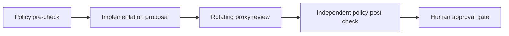

# Workflows

A workflow is a reviewed sequence of specialist stages connected by explicit dependencies. It converts a work item into artifacts and evidence, then stops for a human decision.

## Default delivery workflow

The packaged workflow ID is `delivery`.



| Stage | Agent | Passing verdicts | Purpose |
|---|---|---|---|
| `policy-precheck` | `policy-guardian` | `ALIGNED`, `CONDITIONALLY_ALIGNED` | Confirm policy consistency and testable outcome before delivery. |
| `implementation` | `coding-worker-codex` | `COMPLETE` | Produce the smallest independently reviewable implementation artifact. |
| `validation` | rotating `Proxy Reviewer` pool | `PASS` | Map evidence to all acceptance criteria and disclose concerns using a model other than the implementation producer. |
| `policy-postcheck` | rotating `Policy Reviewer` pool | `ALIGNED`, `CONDITIONALLY_ALIGNED` | Compare delivered evidence to scope using a model other than the implementation and validation producers. |

`NOT_ALIGNED` and `FAIL` block progression. A blocked or malformed run does not reach final approval.

Reviewer selection is durable and model-aware. The router excludes every agent and
model that produced the reviewed artifacts, then chooses the least-used eligible
reviewer while avoiding the previous reviewer agent and model when alternatives
exist. Every assignment is stored in SQLite and emitted as `reviewer.assigned`.

```bash
agent-factory reviews list
agent-factory reviews list --run-id 1
```

## Run the workflow

```bash
agent-factory workflow run --task-id 1 --workflow delivery --mode simulation
```

Simulation permits deterministic fallback and labels its artifacts. It is the right mode for demonstrations, CI, configuration changes, and contract tests.

Live mode prohibits deterministic fallback:

```bash
agent-factory workflow run --task-id 1 --workflow delivery --mode live
```

In version 0.1 this command is deliberately fail-closed: it does not create, approve, or consume provider gates on the operator's behalf, so the first real stage stops without an injected approval. Use the single-provider `providers request`, `approve`, and `invoke` path for controlled live evaluations until per-stage approval orchestration is complete.

## Stage result contract

A real provider stage returns one JSON object:

```json
{
  "verdict": "PASS",
  "criteria_evidence": {
    "Criterion one": "Concrete artifact, test result, or inspected behavior.",
    "Criterion two": "Concrete artifact, test result, or inspected behavior."
  },
  "summary": "Short conclusion and residual risk."
}
```

Contract rules:

- `verdict` must be known and allowed by the stage;
- `criteria_evidence` must map every declared criterion to non-empty evidence;
- `summary` should identify material concerns;
- malformed JSON fails the stage;
- provider success alone does not imply stage success;
- a blocking verdict fails the run immediately.

Known verdict vocabulary:

- passing: `COMPLETE`, `PASS`, `ALIGNED`, `CONDITIONALLY_ALIGNED`;
- blocking: `FAIL`, `NOT_ALIGNED`.

## Workflow definition

Defaults live in `agent_factory/defaults/workflows.json`. A workflow contains guardrails and stages:

```json
{
  "id": "delivery",
  "name": "Review-gated delivery",
  "guardrails": {
    "precheck_stage": "policy-precheck",
    "postcheck_stage": "policy-postcheck",
    "guardian_agent": "policy-guardian"
  },
  "stages": [
    {
      "id": "policy-precheck",
      "name": "Policy and scope pre-check",
      "agent": "policy-guardian",
      "artifact": "policy_precheck.json",
      "depends_on": [],
      "acceptance_criteria": [
        "The task is consistent with configured policy",
        "The expected outcome is explicit and testable"
      ],
      "contract": {
        "allowed_verdicts": ["ALIGNED", "CONDITIONALLY_ALIGNED", "NOT_ALIGNED"]
      }
    }
  ]
}
```

## Graph validation

Before execution, the validator rejects:

- an empty stage list;
- missing or duplicate IDs;
- missing agent, name, artifact, contract, or acceptance criteria;
- references to missing dependencies;
- dependency cycles;
- stages listed before their dependencies;
- an absent or incorrectly assigned pre-check/post-check boundary;
- delivery stages outside the configured guardrail boundaries;
- a post-check that does not transitively cover all earlier stages.

These checks make the file order deterministic and prevent a delivery path from bypassing review.

## Customize a workflow

1. Copy all packaged defaults to a new configuration directory.
2. Point `AGENT_FACTORY_CONFIG_DIR` at it.
3. Add or edit a workflow without changing the packaged copy.
4. Keep pre-check and post-check guardrails around all delivery stages.
5. Add tests for ordering, blocking verdicts, and missing evidence.
6. Run the workflow in simulation before enabling any live provider.

Every stage agent must exist and be enabled. Its role must also be accepted by its
provider. A stage with `reviewer_pool` must also declare ancestor stages in
`review_of`; the configured default agent must belong to the pool.

## Agent replacement

Provider selection is independent of workflow structure:

```bash
agent-factory agents list
agent-factory agents replace coding-worker-codex --provider ollama --model local:qwen2.5-coder:7b
agent-factory agents disable coding-worker-claude
agent-factory agents enable coding-worker-claude
```

Replacing a provider after an execution gate was approved invalidates that gate's scope. Request a new gate.

## Work-item operations

Claim, execute, and review commands are separate operator actions:

```bash
agent-factory task claim 1
agent-factory task run 1
agent-factory task review 1
```

The current implementation prevents two active runs of the same workflow for the same work item. A terminal decision or failure releases that claim.

## Final decision

After all stages pass, the workflow status becomes `awaiting_approval` and a final gate is created.

```bash
agent-factory approvals list
agent-factory approvals approve 1 --note "All evidence reviewed"
```

Or:

```bash
agent-factory approvals reject 1 --note "Criterion two needs stronger evidence"
```

The decision is immutable. It records a note and a corresponding audit event. It does not automatically publish, merge, or close external work.

## Workflow design guidance

- Give one stage one responsibility.
- Prefer narrow artifacts that another agent can independently inspect.
- Write acceptance criteria before selecting a provider.
- Make dependencies explicit instead of relying on stage order alone.
- Use reviewer pools for validation; the runtime enforces a different model from every reviewed producer.
- Keep policy review outside implementation roles.
- Use `CONDITIONALLY_ALIGNED` only when the condition is explicit in the artifact.
- Keep simulations deterministic enough for regression tests.
